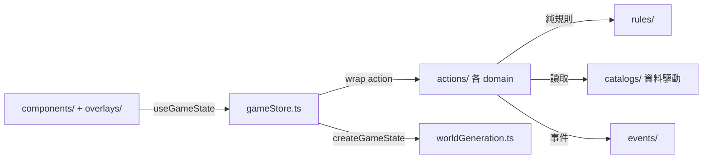
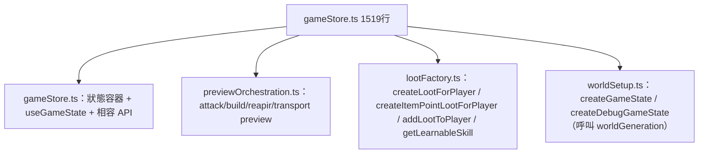

# 代碼健康度報告（2026-08-11）

> 本報告是一次性的程式碼審查紀錄，聚焦工程結構、可讀性、重複與優化建議；**不改變任何遊戲規則**。所有建議均附證據（檔案、行號、代碼片段）與優先級，可直接轉為工單。

---

## 1. 專案總覽

### 1.1 基本數據（2026-08-11 實測）

| 項目 | 結果 |
| --- | --- |
| 測試 | 35 個測試檔 / **304 個測試全部通過**（vitest v4） |
| 建置 | `npm run build` ✅ 通過 |
| Lint | ❌ **10 errors + 1 warning**（詳見 §4.5） |
| 核心型別檔 | `src/game/types.ts`（**513 行**，型別 + 部分執行期常數混雜） |
| 最大單檔 | `src/game/gameStore.ts` **1,519 行**、`src/game/gameStore.test.ts` **1,315 行** |
| 其他大檔 | `worldGeneration.ts` 451、`MapGrid.tsx` 442、`App.tsx` 415 |

### 1.2 架構現況

整體架構已是「分層 + 資料驅動」的良好形狀，本報告的重複與健康度問題都建立在這個好基礎上：



- **規則層** `src/game/rules/`：純函式、無副作用，測試覆蓋佳。
- **目錄層** `src/game/catalogs/`：新增內容（建築、裝備、功法、道具、事件池）只需編輯對應 catalog。
- **行動層** `src/game/actions/`：回傳統一為 `{ state, result: ActionExecutionResult<T> }`（discriminated union），`gameStore` 只做包裝與 preview orchestration。
- **UI 消費層**：`useGameState()`（`useSyncExternalStore`）+ antd 元件，與規則層解耦。

### 1.3 架構級問題（耦合）

| 編號 | 問題 | 證據 | 嚴重度 |
| --- | --- | --- | --- |
| A1 | **`gameStore.ts` 仍是單體巨檔**：1519 行兼任狀態容器、所有 action 包裝、preview 協調、Loot/skill 工廠、createGameState 世界生成、相容性 API | `gameStore.ts` 行數為第二名的 3.5 倍 | **高** |
| A2 | **隱性風險：物件宣告曾經被誤刪** | 先前一次 `multi_replace` 意外刪除了 `export const gameStore = {` 與 `getState`，造成 9 個測試檔解析錯誤。此類錯誤的根因正是 A1 的單體結構 | **高** |
| A3 | **`types.ts` 混入執行期常數**：型別檔內含 `itemPointLootCatalog`、`GameSettings.ruinCount` 等執行期值，破壞「型別檔 = 純型別」的職責 | `types.ts` 513 行 | 中 |
| A4 | **`explorationActions.ts` 內嵌私有 `getActionablePlayer` 副本**，與 `gameStore`、`movementActions` 三處重複（詳見 §3.1） | `explorationActions.ts:21` | 中 |
| A5 | **世界生成使用多個魔術 seed 偏移**：`seed+17 / +31 / +999 / +211 / +baseIndex*17`，無命名常數說明用途 | `worldGeneration.ts:69-70,154,351-352` | 低 |
| A6 | **`gameStore.ts:276` 用 `as unknown as GameState`** 跳過型別檢查（visibility 更新），是型別安全破口 | `gameStore.ts:276` | 低 |

---

## 2. 可讀性檢查

### 2.1 命名

| 位置 | 問題 | 建議 |
| --- | --- | --- |
| `combatActions.ts:181` | `executeAttack` 先宣告 `result`，之後**再補賦值** `result.equipmentDurabilityChanges = ...`（可變物件寫入） | 改為建構時一次附上，見 §4.2 重構後範例 |
| `rules/` 四個檔案 | 守衛條件重複為 `state.activePlayerId !== playerId \|\| state.creatureTurnInProgress \|\| player.turnEnded`（§3.2） | 抽 `assertPlayerTurn` |
| `worldGeneration.ts` | `seed + 999` 等魔術偏移無命名 | 抽 `SEED_OFFSET_*` 常數 |

### 2.2 過長檔案／函數

| 檔案 | 行數 | 關鍵函數長度 |
| --- | --- | --- |
| `gameStore.ts` | 1519 | `createGameState` 等含世界生成、多個 preview action 皆 >100 行 |
| `gameStore.test.ts` | 1315 | 大檔測試，隨 store 拆分同步拆分 |
| `worldGeneration.ts` | 451 | `createMapWithTerrain` 等函數內嵌多種噪音合成 |
| `MapGrid.tsx` | 442 | 渲染 + 事件 + 圖示邏輯混雜 |
| `App.tsx` | 415 | 掛載時**內嵌 17 個 setter 的 reset**、`GameOverlays` 巨型 props 清單 |

**最大佔比檢視**（src 底下最大的 20 個檔案中，`rules/` 單一檔案最多 222 行，尚可；問題集中在 store 與 UI 層）。

### 2.3 註解／文件

- ✅ 良好：`reports/` 已有 13 份設計與健康度文件；`catalogs/` 資料大多有中文說明。
- ⚠️ 待補：`worldGeneration.ts` 的噪音演算法與 seed 偏移無註解；`gameStore` 的相容性 API（如 `resolveAttackTarget`）無「為何保留」的註解。

### 2.4 難懂邏輯

- `combatActions.ts` 的 `executeAttack`：**同一個玩家物件被消耗性鏈式改寫 4–5 次**
  ```ts
  spendPlayerStamina(
    reduceEquipmentDurability(
      reduceEquipmentDurability(
        loot ? dependencies.addLootToPlayer(currentPlayer, loot) : currentPlayer,
        'weapon', 1), 'accessory', 0.5), ACTION_STAMINA_COSTS.attack)
  ```
  且「經驗升級」用 IIFE `(() => {...})()` 塞進物件字面量。閱讀者難以一次掌握「體力→耐久→掉落→升級」的順序語意。
- `executeExternalDamage` 的 `players.map` 內也混入 IIFE 升級邏輯，且 `dependencies.applyExperienceAndLevelUp` 被呼叫了**兩次**（一次算 `progressedPlayer`、一次在物件內 IIFE 重算）。
- `gameStore.ts:276` 的 `as unknown as GameState` 讓編譯器停止檢查該區域。

---

## 3. 重複檢查

### 3.1 `getActionablePlayer` 三處副本（高優先）

| 檔案 | 行號 | 內容 |
| --- | --- | --- |
| `gameStore.ts` | 167 | `find + canPlayerPerformAction` |
| `movementActions.ts` | 34 | 相同 |
| `explorationActions.ts` | 21 | 用 `canPlayerPerformAction(state, playerId, 0)` 實作（多一層包裝） |

三份實作語意應一致（「存活、可行動」），但 `explorationActions` 額外接受了 `0` 體力成本參數。**若規則演進，三處極易失步。**

#### 具體重構
- 新增 `src/game/rules/actionCostRules.ts`：
  ```ts
  export function getActionablePlayer(state: GameState, playerId: string): PlayerState | null {
    const player = state.players.find((candidate) => candidate.id === playerId)
    if (!player || !canPlayerPerformAction(state, playerId, 0).ok) return null
    return player
  }
  ```
- `gameStore`、`movementActions`、`explorationActions` 改為 import 此函式；`CombatActionDependencies.getActionablePlayer` 可改為直接依賴（或保留注入但傳入同一函式）。

### 3.2 回合守衛四處重複（中優先）

`storageRules.ts:27`、`transportRules.ts:21`、`shopRules.ts:84/116/138/182`、`regionalManagementRules.ts:27` 全部是同一行：

```ts
if (state.activePlayerId !== playerId || state.creatureTurnInProgress || player.turnEnded) {
  return { ok: false, reason: '尚未輪到你的回合，或生物回合進行中。' }
}
```

#### 具體重構
- 在 `rules/actionCostRules.ts` 新增：
  ```ts
  export function assertPlayerTurn(state: GameState, playerId: string, player: PlayerState) {
    if (state.activePlayerId !== playerId || state.creatureTurnInProgress || player.turnEnded) {
      return { ok: false as const, reason: '尚未輪到你的回合，或生物回合進行中。' }
    }
    return { ok: true as const }
  }
  ```
- 四個規則檔各 domain 改呼叫 `assertPlayerTurn(state, playerId, player)`。理由字串因此收斂為單一來源。

### 3.3 互動點佔位判斷重複（低優先）

`getRandomFreeInteractionPosition` 與事件 spawn 的各處「空格是否被物品點/事件/基地/巢穴/廢墟佔用」判斷重複存在（`worldGeneration.ts` 內多次列出排除條件）。可抽 `getInteractionOccupiedPositions(state): Set<string>` 統一（key = `row,column`）。

### 3.4 掉落與獎勵計算重複（高優先）

`executeAttack` 與 `executeExternalDamage` 各自獨立計算：

- loot：`nextHealth === 0 && rollChance(CREATURE_DROP_RATE, random)` → `createLootForPlayer`
- learnedSkill：`targetType === 'nest' && nextHealth === 0` → `getLearnableSkill`
- rewards：`targetType === 'creature' && nextHealth === 0` → `getCreatureDefeatRewards`
- 升級：`applyExperienceAndLevelUp`
- 耐久：weapon -1 / accessory -0.5 → `getDurabilityChanges`

兩函式約 80% 邏輯相同，但一個是「進 attack preview 的執行」、一個是「外功直接執行」，**目前已出現漂移**：
- `executeAttack` 才有的：`spendPlayerStamina(attack cost)`、`attackPreview: null`、`criticalHit`。
- `getDurabilityChanges` 在 `executeExternalDamage` 是建構時帶入、在 `executeAttack` 是**事後對 `result` 賦值**。

#### 具體重構（H3）
1. 抽 `resolveCombatRewards(target, ...)` 統一 loot / learnedSkill / rewards / 升級計算。
2. 抽 `applyPlayerCombatResult(player, { loot, learnedSkill, money, exp, durability, stamina })` 取代 IIFE 與鏈式改寫。
3. 讓 `executeAttack` 在建構 `result` 當時就帶入 `equipmentDurabilityChanges`，移除事後賦值。
4. 讓 `executeExternalDamage` 只呼叫一次 `applyExperienceAndLevelUp`。

### 3.5 其餘小重複

- `RuinDetailsModal.tsx` 硬編碼 `'2 格視野'` / `'1 格視野與 1 格射程'`；`WorldObjectOverlays.tsx` 硬編碼 `['獲得 20 經驗值']` / `['獲得 10 經驗值']`（應 import `RUIN_RECONSTRUCT_EXPERIENCE` 等常數）。
- `combatActions.ts` 的 `getDurabilityChanges` 中，slot → 中文標籤的 map 與 `equipmentViewData.ts` 重複。

---

## 4. 優化建議（依優先級）

### 4.0 第一階段優化實施結果（2026-08-11）

- [x] 修正 9 個 `no-irregular-whitespace` lint errors。
- [x] 將 `gameStore.ts` 的 `useInfirmaryAction` import 別名改為 `infirmaryAction`，消除 React Hook 規則誤判。
- [x] 補齊 `App.tsx` 探索事件 effect 的依賴，消除 `react-hooks/exhaustive-deps` warning。
- [x] 抽出共用 `getActionablePlayer` 至 `rules/actionCostRules.ts`，移除 `movementActions.ts` 與 `explorationActions.ts` 的副本。
- [x] 抽出共用 `assertPlayerTurn` 至 `rules/actionCostRules.ts`，並套用至 storage、transport、shop、regional management rules。
- [x] 驗證結果：`npm run lint` 通過；`npm run build` 通過；35 個測試檔、304 個測試全部通過。
- [ ] 建置仍顯示 JavaScript bundle 超過 500 kB 的提示；包體與 code splitting 暫不處理，延後至專案功能完成後再評估。

### 4.0.1 第二階段優化實施結果：H3 戰鬥流程（2026-08-11）

- [x] `combatActions.ts` 抽出 `resolveCombatRewards`，統一普通攻擊與外功的掉落、學習功法、擊殺獎勵與經驗升級計算。
- [x] 抽出 `applyCombatPlayerState`，統一裝備耐久、掉落加入、功法加入、金錢、經驗、體力與外功使用紀錄的更新。
- [x] 移除 `executeExternalDamage` 內重複的 `applyExperienceAndLevelUp` 呼叫。
- [x] `executeAttack` 的 `equipmentDurabilityChanges` 改為在 result 建構時一次產生，不再事後突變 `result`。
- [x] 驗證結果：`combatActions.ts` 無診斷；`npm run lint`、`npm run build` 通過；35 個測試檔、304 個測試全部通過。

### 4.0.2 第三階段優化實施結果：H1 戰利品工廠拆分（2026-08-11）

- [x] 新增 `src/game/lootFactory.ts`，集中處理普通掉落、物品點掉落、功法學習與戰利品加入玩家。
- [x] 從 `gameStore.ts` 移除上述 4 組獨立邏輯，改由模組 import，降低 store 的領域耦合。
- [x] `nextEquipmentInstanceId` 已移至 loot factory，裝備實例產生責任集中。
- [x] 驗證結果：`npm run lint`、`npm run build` 通過；35 個測試檔、304 個測試全部通過。
- [ ] `gameStore.ts` 仍需繼續拆出 preview orchestration 與 world setup，H1 尚未全部完成。

### 4.0.3 第四階段優化實施結果：H1 世界初始化拆分（2026-08-11）

- [x] 新增 `src/game/worldSetup.ts`，集中處理標準遊戲狀態與 debug 遊戲狀態建立。
- [x] `gameStore.ts` 改以 re-export `createGameState` / `createDebugGameState`，維持既有測試與外部 API 相容。
- [x] 保留 `createLegacyDebugGameState` 作為暫時相容函式，避免一次搬遷過大；後續可確認無使用後刪除。
- [x] 驗證結果：`npm run lint`、`npm run build` 通過；35 個測試檔、304 個測試全部通過。
- [ ] `gameStore.ts` 尚有舊 debug 建立邏輯與 preview orchestration，H1 仍需後續清理。

### 4.0.4 第五階段優化實施結果：H1 Debug 清理與 Preview 拆分（2026-08-11）

- [x] 確認 `createLegacyDebugGameState` 與舊 `createDebugMap` 無外部使用後移除。
- [x] 新增 `src/game/previewOrchestration.ts`，集中普通攻擊、外功與修理 preview 的純計算與條件驗證。
- [x] `gameStore.ts` 改為只負責 preview 狀態寫入與 action 呼叫，降低 UI/store orchestration 與規則計算的耦合。
- [x] 驗證結果：`npm run lint`、`npm run build` 通過；35 個測試檔、304 個測試全部通過。
- [ ] `gameStore.ts` 仍保留 store API 與部分同步狀態更新；H1 可再評估是否拆出相容性 API 層。

### 4.0.5 第六階段優化實施結果：H1 Store Action Adapter（2026-08-11）

- [x] 新增 `src/game/storeAdapters.ts`，統一 `{ state, result }` action 的狀態套用與結果回傳流程。
- [x] 先套用至武館與商店 action：`learnSkillAtMartialHall`、`buyItem`、`sellItem`、`sellEquipment`、`buyEquipment`。
- [x] 保留原有 `gameStore` 方法名稱與參數，外部呼叫 API 不變。
- [x] `gameStore.ts` 目前約 **1,062 行**；本批未處理包體與 code splitting。
- [x] 驗證結果：`npm run lint`、`npm run build` 通過；35 個測試檔、304 個測試全部通過。
- [ ] 後續可將其餘純 action adapter 逐批遷移；涉及額外狀態變更的建築 prestige、回合與傳送流程應維持專用邏輯。

### 4.0.6 第七階段優化實施結果：H1 Action Adapter 擴展（2026-08-11）

- [x] 將治理、廢墟、探索與倉庫 action 遷移至 `runActionOutcome`。
- [x] 將 `transferBaseMaterials` 遷移至 `runActionExecution`。
- [x] 保留建築 prestige、裝備、道具、修理、傳送等具有額外狀態處理的流程，不強行抽象。
- [x] 驗證結果：`npm run lint`、`npm run build` 通過；35 個測試檔、304 個測試全部通過。
- [ ] 包體優化與 code splitting 依專案決策延後，不列入本階段工作。

### 4.0.7 第八階段優化實施結果：Adapter 測試與 Seed 可讀性（2026-08-11）

- [x] 新增 `src/game/storeAdapters.test.ts`，覆蓋 action 執行一次、state 套用、失敗原因保留與泛型 data 回傳。
- [x] `worldSetup.ts` 將 `seed + 101/307/409/503/701/809` 改為 `WORLD_SEED_OFFSETS` 具名常數。
- [x] seed offset 數值未改變，既有世界生成結果維持相容。
- [x] 驗證結果：`npm run lint`、`npm run build` 通過；36 個測試檔、307 個測試全部通過。
- [ ] 包體優化與 code splitting 仍依專案決策延後。

### 4.0.8 第九階段優化實施結果：Preview 邊界測試（2026-08-11）

- [x] 新增攻擊 preview 目標消失後執行失敗的回歸測試。
- [x] 新增外功 preview 建立後玩家內力不足的回歸測試。
- [x] 驗證兩種失敗情境都會清除對應 preview，避免 UI 保留過期確認狀態。
- [x] 驗證結果：`npm run lint`、`npm run build` 通過；36 個測試檔、309 個測試全部通過。
- [ ] 包體優化與 code splitting 仍依專案決策延後。

### 4.0.9 第十階段優化實施結果：H2 Actionable Player 統一（2026-08-11）

- [x] `gameStore.ts` 移除自有 `getActionablePlayer`，改使用 `rules/actionCostRules.ts` 的共用實作。
- [x] 共用判定補上 `player.turnEnded`，保持與原 gameStore 行為一致。
- [x] 新增 `src/game/rules/actionCostRules.test.ts`，涵蓋當前玩家、非當前玩家、生物回合、結果視窗、遊戲結束、勝利、死亡與已結束回合。
- [x] 驗證結果：`npm run lint`、`npm run build` 通過；37 個測試檔、317 個測試全部通過。
- [ ] 包體優化與 code splitting 仍依專案決策延後。

| 優先級 | 建議 | 影響 |
| --- | --- | --- |
| **H1** | 拆分 `gameStore.ts`（見 4.1） | 消除 A1/A2 風險，讓後續重構可測試 |
| **H2** | 統一 `getActionablePlayer` 與回合守衛 `assertPlayerTurn`（§3.1/§3.2） | 消除 3+4 處重複，規則演進不失步 |
| **H3** | 重構 `combatActions.ts`：抽 `resolveCombatRewards` / `applyPlayerCombatResult`（§3.4） | 消除雙執行路徑漂移、IIFE 與鏈式改寫 |
| **M1** | `types.ts` 執行期常數移到所屬 catalog（如 `itemPointLootCatalog` → catalogs） | 型別檔回歸純型別 |
| **M2** | `worldGeneration.ts` 魔術 seed 偏移命名化；補噪音演算法註解 | 可讀性 |
| **M3** | `MapGrid.tsx`、`App.tsx` 拆分：render-only 元件；`GameOverlays` props 收斂為 `{ state, dispatch, services }`；掛載 reset 改為 build-time 預設 | UI 層職責清晰 |
| **L1** | `getInteractionOccupiedPositions` 統一互動點佔位判斷 | 減少 worldgen 重複 |
| **L2** | 硬編碼字串改 import 常數（RuinDetailsModal / WorldObjectOverlays） | 單一來源 |
| **L3** | 補 `gameStore` 相容性 API 的「為何保留」註解 | 文件 |
| **L4** | `gameStore.test.ts` 隨 H1 拆分 | 測試可維護性 |

### 4.1 H1：`gameStore.ts` 拆分藍圖



- 每個新檔自帶對應 `*.test.ts`，逐步搬遷、逐步驗證（目前 304 測試是安全網）。
- 目標：`gameStore.ts` ≤ 400 行，且**不再包含任何獨立可測試的邏輯**（僅剩狀態容器與薄包裝）。
- 防護：搬遷完立即跑 `npm run build` + `npx vitest run`。

### 4.2 H3 重構後範例（combatActions）

```ts
// 建構 result 時一次帶入，不再事後賦值
const result: AttackExecutionResult = {
  ...resolveCombatRewards(target, preview.targetType, nextHealth, random, dependencies),
  equipmentDurabilityChanges: getDurabilityChanges(target.player, playerAfterDurability, [
    { slot: 'weapon', amount: 1 }, { slot: 'accessory', amount: 0.5 },
  ]),
  // ...
}
```

### 4.3 可讀性建議（§2 對應）

- 以 `applyPlayerCombatResult` 取代 IIFE 與 4–5 層鏈式改寫。
- `types.ts` 的執行期常數遷出（M1）。
- 大檔函數超過 ~80 行時優先拆出小函數；`MapGrid` 的 cell rendering 抽成 `TerrainCell` / `ObjectLayer` 元件。

### 4.4 減少重複建議（§3 對應）

- 三個 `getActionablePlayer` → 一個（H2）。
- 四個 rules 檔的回合守衛 → `assertPlayerTurn`（H2）。
- `executeAttack` / `executeExternalDamage` → 共用 `resolveCombatRewards`（H3）。
- `getDurabilityChanges` 的 slot 標籤 map 對齊 `equipmentViewData.ts`。

### 4.5 Lint 修正清單（10 errors + 1 warning，可直接開工）

| 檔案 | 位置 | 規則 |
| --- | --- | --- |
| `App.tsx` | 116:6 (warning) | `react-hooks/exhaustive-deps`：`useEffect` 缺 `activePlayer`、`setDetailsExplorationEventId` |
| `BuildingListModal.tsx` | 98:76, 99:34 | `no-irregular-whitespace` |
| `CreatureNestDetailsModal.tsx` | 68:49 | `no-irregular-whitespace` |
| `MartialHallModal.tsx` | 26:52, 26:98, 38:458, 48:452 | `no-irregular-whitespace` |
| `SkillTestPage.tsx` | 113:65, 119:92 | `no-irregular-whitespace` |
| `gameStore.ts` | 1241:22 | `react-hooks/rules-of-hooks`：import 別名 `useInfirmaryAction` 以 `use` 開頭造成誤判 |

> `gameStore.ts:1241` 是**誤判**（該標識是 action 函式 import 別名，非 Hook），但 eslint 無法辨識；修法：改 import 別名（如 `infirmaryAction`）或加上檔案層級 disable 註解。

### 4.6 lint 修正施作方針

```txt
1. 先處理 9 個 no-irregular-whitespace（機械性：刪除全形空白）。
2. gameStore.ts:1241 改 import 別名或行內 eslint-disable 註解。
3. App.tsx:116 補依賴或重構 effect。
4. 修正後 npm run lint 應歸零；再跑 npx vitest run 確認無回歸。
```

---

## 5. 總結

### 5.1 健康度評分

| 面向 | 評分（/10） | 說明 |
| --- | --- | --- |
| 功能正確性 | 9.5 | 304 測試全過、build 通過、規則層測試覆蓋佳 |
| 架構分層 | 8.5 | catalog/rules/actions 分層成熟 |
| 重複與冗餘 | 5.5 | 雙戰鬥路徑、三份 getActionablePlayer、四檔守衛重複 |
| 單檔規模 / 可維護性 | 4.5 | gameStore 1519 行、測試 1315 行 |
| 型別安全 | 7.5 | 有 `as unknown as GameState` 破口與 `types.ts` 職責混淆 |
| **整體** | **7 / 10** | 功能成熟、結構健康，但重複與單體 store 拖累長期可維護性 |

### 5.2 最重要的三個優化方向

1. **H1 — 拆分 `gameStore.ts`**（影響最大）：消除單體巨檔與誤刪隱患，讓狀態容器回歸薄包裝；配合測試檔同步拆分。
2. **H3 — 重構 `combatActions.ts`**（正確性風險最高）：統一雙執行路徑，消除 `executeAttack` 的 result 事後賦值與 `applyExperienceAndLevelUp` 雙重呼叫。
3. **H2 + M1 — 統一行動守衛與型別職責**（重複最高、成本最低）：一個 `getActionablePlayer`、一個 `assertPlayerTurn`，`types.ts` 常數遷出，即可消除本報告 §3 中約 80% 的重複。

> 施作順序建議：**Lint 歸零 → H2（低成本高收益）→ H3 → H1（配合測試拆分）**。每一階段結束跑 `npm run build` + `npx vitest run` 驗證無回歸。