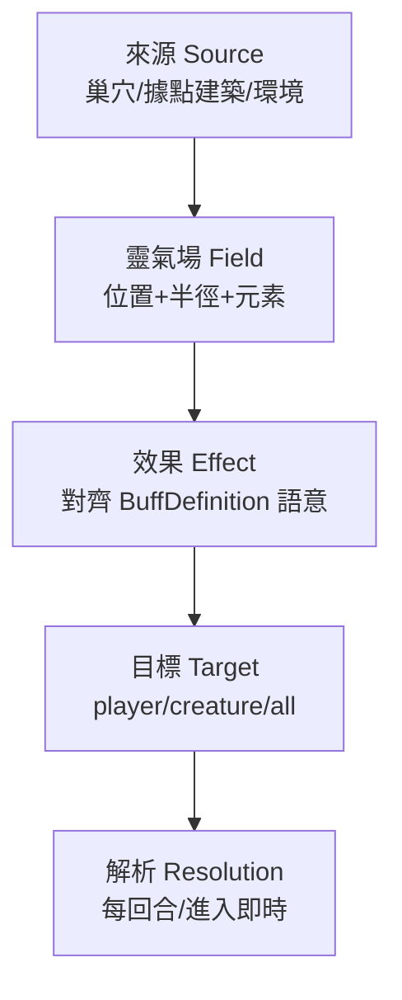

# 區域靈氣系統設計文件 (Regional Spiritual Energy System Design Document)

## 1. 文件目的

本文件定義「區域靈氣」的**抽象系統**：一種由地圖上具位置的實體（敵方巢穴、玩家據點建築）向四周散發、對範圍內單位產生持續性影響的「影響力場」框架。目標是讓「巢穴靈氣」與「據點靈氣」（如防衛營回血）共用同一套抽象底層，而非各自獨立實作。

> **重要**：本文件只描述抽象系統與規則契約，不涉及實作程式碼。所有引用既有型別/函式僅作為「語意錨點」，用於對齊設計與現有程式碼的語意一致性。

---

## 2. 設計目標

- **統一抽象**：巢穴（負面靈氣）與據點建築（正面靈氣）共用一套「來源 → 影響力場 → 效果 → 目標」的抽象鏈。
- **復用既有語意**：元素復用 `MartialElement`；效果欄位復用 `BuffDefinition` 的效果語意；範圍採用既有曼哈頓距離。
- **低耦合、純查詢**：靈氣解析是純函式查詢，不主動寫入狀態，避免污染回合管線與既有 action。
- **可擴充**：未來可新增任意「靈氣來源」與「靈氣效果」而不改動框架。

---

## 3. 與現有程式碼的語意錨點

設計前先盤點既有系統，確認哪些概念可直接復用、哪些需抽象。

### 3.1 元素：復用 `MartialElement`

`src/game/rules/skillRules.ts` 已定義：

```ts
export type MartialElement = 'none' | 'metal' | 'wood' | 'water' | 'fire' | 'earth'
```

並提供 `getSchoolElement(schoolId)` 將功法流派映射到元素。區域靈氣的「屬性」**直接復用此型別**，不再另建 `ElementalAffinity`。

| 流派（`MartialSchoolId`） | 元素 |
| :--- | :--- |
| `golden-body` / `sharp-edge` | `metal`（金） |
| `swift-wind` / `hundred-poison` | `wood`（木） |
| `frost-water` / `misty-rain` | `water`（水） |
| `scarlet-flame` / `blazing-sun` | `fire`（火） |
| `earth-mountain` / `yellow-earth` | `earth`（土） |
| `void-spirit` / `ghost-shadow` / 未指定 | `none`（無屬性） |

### 3.2 效果語意：復用 `BuffDefinition` 的效果欄位

`src/game/catalogs/buffCatalog.ts` 的 `BuffDefinition` 已定義一整套效果欄位，區域靈氣的「效果」應對齊其語意，而非重新發明：

| BuffDefinition 欄位 | 適用於區域靈氣的效果語意 |
| :--- | :--- |
| `damageReductionPercent` | 減傷（正面） |
| `healthRegenPercent` / `innerPowerHealthRegenPercent` | 每回合回血（正面，防衛營） |
| `damageDealtPercent` / `externalSkillDamagePercent` | 傷害加成 |
| `maxHealthDamagePercent` | 每回合掉血（負面，巢穴灼燒/毒） |
| `attributeMultiplier` / `attributeModifiers` | 屬性增減 |
| `terrainCostOverrides` / `terrainCostMultipliers` | 移動消耗改變（負面，巢穴減速） |
| `evasionRateBonus` / `criticalRateBonus` | 機率型增益 |
| `immobilized` / `stunned` / `confused` | 控制（通常不應由靈氣持續施加，需慎用） |

> **關鍵設計決策**：區域靈氣的效果**是「環境施加的被動效果」**，與 `BuffDefinition`（掛在單位上的 Buff）語意一致，但來源不同——前者來自「所在區域」，後者來自「自身狀態」。二者可在「效果套用」層統一，但在「生命週期」層分離（見 §5）。

### 3.3 範圍：復用曼哈頓距離

既有移動、視野、防衛營範圍皆採曼哈頓距離：

```ts
// baseRules.ts
export const BASE_INFLUENCE_RANGE = 5
export function isPlayerWithinBaseVision(base, player): boolean {
  const distance = Math.abs(base.position.row - player.position.row)
    + Math.abs(base.position.column - player.position.column)
  return distance <= BASE_INFLUENCE_RANGE
}
```

區域靈氣的「範圍判定」沿用同一曼哈頓距離公式，避免引入圓形半徑等新幾何。

### 3.4 每回合解析時序：對齊防衛營回血與巢穴回血

既有「每回合結束」的區域性效果已存在兩處，可作為解析時序的錨點：

- `getBarracksRecovery(base)`：防衛營每回合回血（`baseRules.ts`）。
- 巢穴每回合回血 `NEST_HEALTH_REGEN_PER_ROUND`（`creatureActions.ts` 的 `spawnCreaturesFromNests`）。

區域靈氣的「持續效果」應在同一回合結算點解析，避免新增第三種時序。

### 3.5 來源追蹤與失活：復用 `GlobalBuff` 骨架

`src/game/rules/globalBuffRules.ts` 的 `GlobalBuff` 已具備一套成熟的抽象：

```ts
export type GlobalBuff = {
  id: string
  kind: GlobalBuffKind          // 效果種類
  magnitude: number             // 效果幅度
  sourceBaseId: string          // 來源追蹤
  sourceBuildingId?: string
  sourceBuildingLevel?: number
}
// getActiveGlobalBuffs：來源失活（active === false）時 buff 自動失效
```

區域靈氣的「來源追蹤 + 失活判定」應借鏡此模式：**來源被摧毀/失活時，其靈氣自動失效**。

---

## 4. 抽象系統模型

### 4.1 抽象層次

區域靈氣系統分四層抽象，由底而上：



### 4.2 第一層：靈氣來源（Aura Source）

一個「靈氣來源」是任何具備 `position` 與可選 `element` 的實體。

| 來源種類 | 現有型別錨點 | 元素來源 | 靈氣傾向 |
| :--- | :--- | :--- | :--- |
| 巢穴 | `CreatureNestState` | `dominantElement`（本設計新增） | 負面（debuff） |
| 據點建築（防衛營等） | `BaseState.buildings` | 依建築定義 | 正面（buff） |
| 環境點（未來） | — | 依地形/環境定義 | 中性或情境 |

**來源生命週期規則**：
- 來源存在且「活躍」（巢穴 `health > 0`、據點 `isBaseActive`）→ 靈氣生效。
- 來源被摧毀/失活 → 靈氣立即失效（無殘留）。

### 4.3 第二層：靈氣場（Aura Field）

「靈氣場」是來源向四周的投射，由以下屬性描述：

| 屬性 | 型別 | 說明 |
| :--- | :--- | :--- |
| `sourceId` | string | 回溯來源 |
| `position` | Position | 中心點（= 來源位置） |
| `radius` | number | 影響半徑（曼哈頓距離） |
| `element` | `MartialElement` | 靈氣屬性（`none` = 中性靈氣） |
| `effects` | `AuraEffect[]` | 此場內施加的效果清單 |

**範圍規則**：
- 影響判定採曼哈頓距離 `distance <= radius`（對齊 `isPlayerWithinBaseVision`）。
- `radius` 由來源定義決定（如巢穴固定半徑、防衛營依 `BASE_INFLUENCE_RANGE`）。

### 4.4 第三層：靈氣效果（Aura Effect）

「靈氣效果」描述一個單位處於靈氣場內時，受到何種影響。**效果語意對齊 `BuffDefinition`（見 §3.2）**，但抽象上比 `BuffDefinition` 更精簡：

```ts
// 抽象描述（非實作程式碼）
type AuraEffectKind =
  | 'damage-over-time'    // 每回合掉血（負面，巢穴灼燒/金煞）
  | 'heal-over-time'      // 每回合回血（正面，防衛營）

type AuraEffect = {
  kind: AuraEffectKind
  magnitude: number       // 效果幅度（百分比或絕對值）
  target: AuraTargetType  // 影響對象（見 §4.5）
}
```

> **註**：`stat-boost/debuff`、`damage-reduction/increase`、`movement-cost` 等被動型效果原為巢穴環境效果設計，但因尚未接入移動/戰鬥計算（無消費方），已於 2026-08-25 從實作中移除。待未來接入實際計算後再行加入。

> **與 `GlobalBuff` 的對照**：`AuraEffect` 對應 `GlobalBuff` 的 `kind + magnitude`，但 `AuraEffect` 是**區域性**（依位置觸發），`GlobalBuff` 是**全域性**（整局生效）。兩者抽象結構高度相似，實作時可考慮共用「效果定義」層。

### 4.5 第四層：目標（Aura Target）

「目標」定義靈氣效果施加於哪些單位，對齊既有 player/creature 區分：

```ts
type AuraTargetType = 'player' | 'creature' | 'all'
```

| 目標 | 說明 | 典型來源 |
| :--- | :--- | :--- |
| `player` | 僅玩家 | 防衛營回血（正面） |
| `creature` | 僅怪物 | 部分巢穴靈氣（削弱入侵者外的友軍？） |
| `all` | 玩家與怪物 | 巢穴環境效果（灼燒/毒不分敵我） |

> **設計注意**：巢穴靈氣若設為 `all`，會連帶影響巢穴自己生出的怪物。需明確「巢穴靈氣是否傷及自家怪物」——若否，巢穴靈氣應設為 `player`；若是（環境無差別），則 `all`。

---

## 5. 解析與生命週期

### 5.1 解析時序

區域靈氣的「持續效果」在**每回合結算點**解析（對齊 §3.4）：

- **每回合結束**：`heal-over-time`（防衛營回血）、`damage-over-time`（巢穴灼燒）、`movement-cost`（減速）等在回合收尾統一結算。
- **進入即時（被動查詢）**：`damage-reduction`、`damage-increase`、`stat-boost/debuff` 等**非每回合累積**的效果，在戰鬥/移動計算時「即時查詢」玩家是否處於某靈氣場內（對齊 `isPlayerWithinBaseVision` 的查詢模式）。

### 5.2 生命週期規則

| 階段 | 規則 |
| :--- | :--- |
| 生效 | 單位進入靈氣場（`distance <= radius`）即開始受影響 |
| 持續 | 單位停留場內，效果持續（每回合累積型每回合結算；被動型即時查詢） |
| 離開 | 單位移出範圍，效果立即消失（**無殘留，除非另有 Buff 機制**） |
| 失效 | 來源失活/摧毀，整個靈氣場消失 |

> **與 Buff 的邊界**：區域靈氣效果「隨位置即時生效/消失」，不寫入單位 Buff 列表；若未來需要「離開範圍後仍持續 N 回合」的效果，才透過 `BuffDefinition` 的 `duration: 'rounds'` 轉為 Buff（見 §7 未來擴充）。

---

## 6. 疊加與衝突規則

當單位同時處於多個靈氣場，或同一場內有多個同類效果時，需明確定義疊加：

| 效果類別 | 疊加策略 | 對齊語意 |
| :--- | :--- | :--- |
| 百分比減傷/增傷/回血 | **相乘**（`(1±m1)(1±m2)...`） | `globalBuffRules` 的乘法疊加 |
| 每回合絕對值回血/掉血 | **加總** | `getBarracksRecovery` 的加總 |
| 屬性增減 | **取最大絕對值**（避免無限堆疊） | 建議新規則 |
| 移動消耗 | **取最小（最有利）/最大（最不利）**，依來源善惡 | 需明確定義 |
| 不同元素同類效果 | 元素不同視為**獨立效果**，可同時存在 | 對齊五行相生相剋語意 |

**正負靈氣共存**：玩家同時處於「火焰巢穴（每回合掉血）」與「防衛營（每回合回血）」，兩者獨立結算後合併（淨值 = 回血 − 掉血）。

---

## 7. 未來擴充方向（非本次範圍）

- **元素互動**：靈氣場元素與玩家內功/外功元素產生相生相剋（如玩家站在相剋靈氣中獲得減傷）。此與 `five-elements-generation-design.md` 相關，待五行連攜系統穩定後再整合。
- **靈氣轉 Buff**：需要「離開後仍持續」的效果時，將 `AuraEffect` 轉為掛載 `BuffDefinition`。
- **動態變異靈氣**：巢穴元素隨回合變異（見 `nest-mechanics-design.md`，暫緩）。

---

## 8. 開發細節與關聯檔案（僅作對齊參考，非實作指令）

| 既有檔案/符號 | 在抽象系統中的角色 |
| :--- | :--- |
| `skillRules.ts` 的 `MartialElement` / `getSchoolElement` | 靈氣元素型別與「流派→元素」映射 |
| `buffCatalog.ts` 的 `BuffDefinition` | 靈氣效果欄位的語意來源 |
| `globalBuffRules.ts` 的 `GlobalBuff` / `getActiveGlobalBuffs` | 來源追蹤、失活判定、疊加策略的參考骨架 |
| `baseRules.ts` 的 `getBarracksRecovery` / `isPlayerWithinBaseVision` / `BASE_INFLUENCE_RANGE` | 防衛營回血與範圍判定的既有錨點 |
| `creatureActions.ts` 的 `NEST_HEALTH_REGEN_PER_ROUND` / `spawnCreaturesFromNests` | 巢穴每回合結算時序的既有錨點 |
| `terrainCombatRules.ts` 的 `isTerrainResonant` | 「元素 × 位置」判定的既有範式（靈氣可借鏡其「元素環境」概念） |

**與 `nest-mechanics-design.md` 的關係**：巢穴的 `dominantElement` 決定其產生的靈氣元素；巢穴靈氣的效果清單由本抽象系統的 `AuraEffect` 定義。兩份文件互為補充。

**與 `five-elements-generation-design.md` 的關係**：未來「靈氣元素 × 玩家功法元素」的相生相剋，復用該文件的 `isElementGenerating` / `getElementDamageMultiplier` 判定，不另造一套五行規則。

---

## 9. 開發檢查清單（抽象層，非實作）

- [ ] 確認 `CreatureNestState` 新增 `dominantElement?: MartialElement` 欄位（無屬性巢穴可省略或設 `none`）。
- [ ] 定義 `AuraEffectKind` 枚舉與每種效果的「每回合累積型 / 被動查詢型」分類。
- [ ] 定義曼哈頓距離半徑的預設值與各來源的 `radius` 來源（巢穴固定值、防衛營沿用 `BASE_INFLUENCE_RANGE`）。
- [ ] 明確巢穴靈氣的 `target`（`player` vs `all`）——是否傷及自家怪物。
- [ ] 訂定疊加規則（§6）並逐項標注對齊的既有函式。
- [ ] 確認解析時序只有「每回合結束」與「進入即時查詢」兩種，不新增第三種。
- [ ] 確認來源失活 → 靈氣失效的觸發點（巢穴 `health === 0`、據點 `isBaseActive === false`）。

---

## 10. 實作狀態與已知缺口（2026-08-25）

> 本節記錄抽象系統的**實際實作進度**，與 §1–§9 的「設計規格」區分。實作位於 `src/game/rules/auraRules.ts`。

### 10.1 已實作

| 項目 | 狀態 | 說明 |
| :--- | :--- | :--- |
| `AuraEffectKind` / `AuraTargetType` / `AuraEffect` / `AuraField` 型別 | ✅ | 對齊 §4.4 / §4.5 |
| `getNestAuraField(nest)` | ✅ | 依巢穴 `dominantElement` 建立靈氣場；無屬性巢穴回傳 `null` |
| `isWithinAura(field, position)` | ✅ | 曼哈頓距離判定 |
| `getActiveAuraFields(state)` | ✅ | 收集活躍巢穴 + 防衛營靈氣場 |
| `getAuraEffectsAt(state, position, targetType)` | ✅ | 依目標類型過濾效果 |
| `resolveRoundEndAuraEffects()` | ✅ | 回合結束解析累積型效果 |
| `CreatureNestState.dominantElement` | ✅ | `types.ts` 新增欄位 |
| 巢穴生成推導 `dominantElement` | ✅ | `worldGeneration.ts` 用 `getSchoolElement(schoolId)` |
| 防衛營回血整合進靈氣系統 | ✅ | `turnActions.ts` 改用 `resolveRoundEndAuraEffects` |
| 單元測試 | ✅ | `auraRules.test.ts`（16 個測試） |

### 10.2 已移除：被動型效果（2026-08-25）

`stat-boost` / `stat-debuff`、`damage-reduction` / `damage-increase`、`movement-cost` 等被動型效果原為巢穴環境效果設計，但因**尚未接入移動/戰鬥計算（無消費方）**，已從 `auraRules.ts` 實作中移除，僅保留真正生效的累積型效果：

| 效果 | 狀態 |
| :--- | :--- |
| `damage-over-time`（巢穴灼燒/金煞） | ✅ 已接入回合結束結算 |
| `heal-over-time`（防衛營回血） | ✅ 已接入回合結束結算 |

**未來若要重新加入被動型效果**（對齊 §5.1「進入即時查詢」原則），需先完成：
- [ ] 將 `getAuraEffectsAt` 接入移動計算（`movementRules.ts`）以支援 `movement-cost`。
- [ ] 將 `getAuraEffectsAt` 接入戰鬥/屬性計算（`combatActions.ts` / `playerDerivedRules.ts`）以支援 `stat-boost/debuff`、`damage-reduction/increase`。

### 10.3 修改/新增/刪除靈氣的容易程度

| 操作 | 容易程度 | 說明 |
| :--- | :--- | :--- |
| 改數值（灼燒%、半徑） | 極易 | 改 `NEST_AURA_DAMAGE_PERCENT` / `NEST_AURA_RADIUS` 常數 |
| 新增巢穴元素效果 | 易 | 在 `getNestAuraField` 加分支；但被動型需先完成 §10.2 待辦 |
| 新增靈氣來源 | 易 | 在 `getActiveAuraFields` 加來源分支 |
| 刪除靈氣 | 極易 | 移除對應分支或回傳 `null` |

---

> **⚠️ 文件殘留**：本文件 §1–§10 為重寫後的抽象系統規格；文件末尾仍有一段**舊版殘留內容**（重複的「## 3. 核心概念：區域靈氣」及其子節），與 §1–§10 內容重疊，建議後續清理刪除。

## 3. 核心概念：區域靈氣

### 3.1 定義

區域靈氣是指在遊戲地圖上特定範圍內存在的、由特定來源（如巢穴、據點建築）產生的能量場。這些能量場會對進入其影響範圍的單位（玩家、怪物）或環境產生持續性的效果。

### 3.2 靈氣來源與類型

區域靈氣可以由多種來源產生，並根據來源的不同而呈現不同的類型與效果：

#### 3.2.1 巢穴靈氣 (Nest Auras)

-   **來源**：敵方巢穴。
-   **關聯性**：巢穴的「主導元素」決定了其產生的區域靈氣類型。
-   **效果**：根據巢穴主導元素的五行屬性，產生對玩家不利的環境效果（詳情請參閱 `reports/system/nest-mechanics-design.md`）。
    -   例如：火焰巢穴產生「熾熱靈氣」，對範圍內玩家造成持續火焰傷害或降低移動速度。水之巢穴產生「潮濕靈氣」，減緩玩家移動或打斷攻擊。

#### 3.2.2 據點靈氣 (Base Auras)

-   **來源**：玩家建造的據點建築，例如「防衛營」(Barracks)。
-   **關聯性**：由特定建築的功能或升級狀態決定。
-   **效果**：通常為對玩家有利的效果，例如：
    -   **治療靈氣**：由防衛營產生，為範圍內玩家提供持續的生命恢復。
    -   **增益靈氣**：由其他建築（如軍營、祭壇）產生，提供屬性加成、抗性提升等。

### 3.3 靈氣的影響範圍與強度

-   **範圍 (Radius)**：每個靈氣源都有一個影響範圍，通常以其為中心呈圓形或方形擴散。
-   **強度 (Strength)**：靈氣的效果強度可以由來源決定，或根據玩家與來源的距離衰減。

## 4. 系統互動與共用機制探討

### 4.1 巢穴靈氣與玩家互動

-   玩家進入巢穴靈氣範圍時，會受到相應的正面或負面效果影響。
-   玩家可能需要透過特定裝備、技能或內功來抵抗或利用這些靈氣。

### 4.2 據點靈氣與防衛營的共用系統

-   **核心想法**：區域靈氣系統可以設計成一個通用的「影響力場」框架。巢穴和據點建築都作為「靈氣源」，向周圍釋放不同類型的「靈氣效果」。
-   **防衛營的應用**：
    -   防衛營可以被設計為產生一個「庇護靈氣」(Sanctuary Aura)，為範圍內的玩家提供生命恢復效果。
    -   這個「庇護靈氣」的機制可以與巢穴靈氣的機制共用底層框架，例如：
        -   **靈氣類型定義**：定義不同的靈氣類型（如 `healing-aura`, `damage-aura`, `stat-boost-aura`）。
        -   **效果應用邏輯**：統一處理靈氣對單位屬性（生命、移動、攻擊等）的影響。
        -   **範圍判定**：統一處理單位是否在靈氣範圍內。
-   **潛在優勢**：
    -   **開發效率**：減少重複開發，提高程式碼的可維護性。
    -   **系統一致性**：讓遊戲內不同區域的影響力場有統一的規則和表現。
    -   **擴展性**：未來可以輕鬆添加更多產生靈氣的建築或環境元素。

### 4.3 靈氣之間的疊加與衝突

-   當玩家處於多個靈氣範圍內時，需要定義靈氣效果的疊加規則（例如，加法、乘法、取最大值、或互相覆蓋）。
-   例如，玩家可能同時處於一個「火焰巢穴」的傷害靈氣和防衛營的治療靈氣範圍內，需要明確計算最終受到的效果。

## 5. 資料模型建議

可以考慮引入一個通用的 `Aura` 結構來管理所有區域靈氣：

```ts
// 靈氣效果的基礎類型
type AuraEffectType = 'damage_over_time' | 'heal_over_time' | 'stat_boost' | 'stat_debuff' | 'movement_slow' | 'attack_interrupt';

// 單一靈氣效果的定義
type AuraEffect = {
  type: AuraEffectType;
  element?: ElementalAffinity | 'neutral'; // 影響的元素屬性，或中性
  value: number; // 效果數值
  duration?: number; // 持續時間 (秒或回合)
  targetType: 'player' | 'creature' | 'all'; // 影響的目標類型
  // ... 其他效果相關屬性
};

// 單一區域靈氣的狀態
type Aura = {
  id: string; // 靈氣的唯一ID
  sourceId: string; // 產生此靈氣的來源ID (e.g., nest ID, building ID)
  sourceType: 'nest' | 'building' | 'environment'; // 靈氣來源類型
  position: Position; // 靈氣中心點
  radius: number; // 影響範圍半徑
  strength: number; // 靈氣強度，可能影響效果數值
  effects: AuraEffect[]; // 此靈氣包含的所有效果列表
  // ... 其他靈氣相關屬性
};
```

## 6. 實施考量與後續步驟

-   **文件關聯**：此設計將與 `nest-mechanics-design.md` 文件緊密結合，並可能需要更新 `defense-structures-design.md` 或新增建築設計文件。
-   **數值平衡**：靈氣的效果強度、範圍、持續時間等需要仔細平衡，避免過於影響遊戲體驗。
-   **視覺表現**：需要設計靈氣在遊戲中的視覺表現（例如，地面上的光圈、粒子效果），以便玩家能直觀地感知。
-   **後續步驟**：
    1.  定義具體的靈氣類型及其效果數值。
    2.  細化防衛營產生「庇護靈氣」的具體機制與數值。
    3.  設計靈氣疊加與衝突的規則。
    4.  更新怪物生成邏輯，使其能讀取並響應巢穴產生的靈氣。
    5.  更新玩家內功/外功系統，使其能與區域靈氣產生互動。
    6.  設計 UI 提示來展示玩家周圍的靈氣效果。
