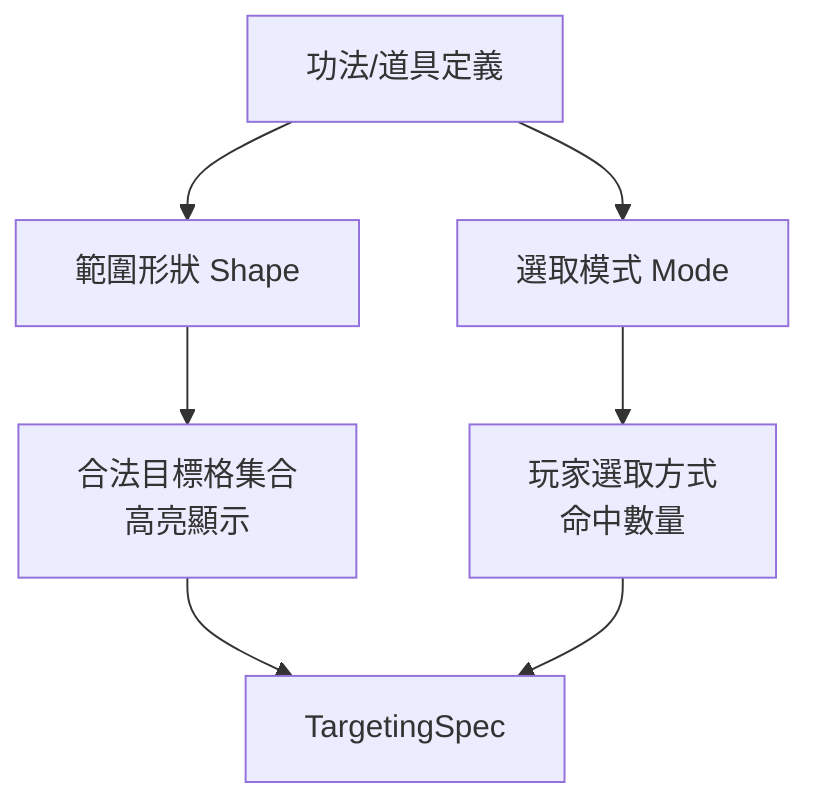

# 攻擊目標選取流程抽象化開發文件（Targeting Flow Abstraction Design Document）

## 1. 文件目的

本文件規劃將「使用 → 顯示高亮 → 選擇對象」的攻擊目標選取流程**抽象化**，以支援「攻擊範圍區域」的功法（即非相鄰、可指定曼哈頓距離範圍的外功）。

> **背景**：目前遊戲中所有攻擊（普通攻擊、傷害型外功、元素爆發道具）都**硬編碼為「相鄰一格」（`isAdjacent`）**。`ExternalSkill` 型別雖已預留 `range?: number` 欄位，但從未被 targeting 流程使用。本文件旨在將「相鄰」這個隱含假設抽離，改為「可變範圍」的統一抽象。

---

## 2. 現況分析：目前 targeting 流程的隱含假設

### 2.1 現有流程全景

```
玩家發起攻擊（外功/普通攻擊/元素爆發道具）
    │
    ▼
gameStore 設定 operation = { type: 'targeting-*' }
    │
    ▼
App.tsx 依 operation.type 計算 targeting 旗標
    ├── attackTargeting = operation.type === 'targeting-attack'
    ├── externalSkillTargeting = operation.type === 'targeting-external-skill'
    └── itemTargeting = operation.type === 'targeting-item'
    │
    ▼
MapGrid 計算「可攻擊目標格」並高亮
    │
    ▼
玩家點擊目標格 → preview 預覽 → execute 執行
```

### 2.2 關鍵硬編碼點（需抽象處）

| # | 檔案/位置 | 目前行為 | 問題 |
| :--- | :--- | :--- | :--- |
| 1 | `types.ts` 的 `isAdjacent` / `getAdjacentPositions` | 固定回傳上下左右 4 格 | 「相鄰」是全域唯一距離概念 |
| 2 | `targetRules.ts` 的 `getAttackTarget` | `isAdjacent(player.position, target.position)` 硬性檢查 | 外功範圍無法擴充 |
| 3 | `MapGrid.tsx` 的 `attackableTargetCellIds` | 用 `getAdjacentPositions(activePlayer.position)` 過濾目標 | 高亮範圍寫死為相鄰 |
| 4 | `previewOrchestration.ts` 的 `createItemBurstPreview` | 直接找 target，**未檢查距離**（靠 MapGrid 已過濾） | 道具無範圍概念 |
| 5 | `combatActions.ts` 的執行路徑 | 依 preview 執行，未重新驗證範圍 | 依賴上層已驗證 |
| 6 | `externalSkillCatalog.ts` 的 `ExternalSkill.range` | 欄位已存在但**從未使用** | 功能缺口 |

### 2.3 現有 targeting operation 型別（`types.ts`）

```ts
export type GameOperation =
  | { type: 'idle' }
  | { type: 'moving'; movementUsed: boolean }
  | { type: 'targeting-attack' }                        // 普通攻擊
  | { type: 'targeting-external-skill'; skillId: string } // 傷害型外功
  | { type: 'targeting-item'; itemId: string }          // 元素爆發道具
  | { type: 'previewing-attack' }
  | { type: 'previewing-item-burst' }
  | { type: 'previewing-external-skill' }
  | { type: 'building-defense'; baseId: string; structureType: DefenseStructureType; position: Position | null }
```

---

## 3. 抽象設計

### 3.1 核心概念：範圍形狀 × 選取模式（正交分離）

要同時支援「範圍內選 1 個」「範圍內全部命中」「指定範圍形狀」等需求，必須將兩個**正交**的概念分離：

```
攻擊目標選取 = 範圍形狀 (Shape) × 選取模式 (Mode)
```

- **範圍形狀（Shape）**：決定「哪些格子是合法目標」（例如：曼哈頓半徑 3 格內、十字、周遭 1 格）。
- **選取模式（Mode）**：決定「在合法格子中，玩家如何選取、最終命中多少目標」（例如：點選 1 個、全部命中）。

兩者獨立定義，可自由組合，未來擴充時「加新形狀」或「加新模式」互不影響。



### 3.2 範圍形狀（Targeting Shape）

以「曼哈頓距離」為基礎幾何，形狀是一組純函式，輸入「原點 + 參數」，輸出「合法目標格集合」。形狀彼此獨立、可插拔。

```ts
/** 範圍形狀的種類。 */
export type TargetingShape =
  | { kind: 'radius'; range: number }          // 曼哈頓半徑 range 格內（range=1 即周遭 4 格）
  | { kind: 'cross'; length: number }          // 十字形（上下左右各 length 格）
  | { kind: 'line'; length: number }           // 直線（單方向，需配合方向參數）
  | { kind: 'custom'; cellIds: string[] }      // 自訂格子集合（劇本編輯器等）

/**
 * 依形狀與原點，回傳所有「合法目標格」的 cell id 集合。
 * 純函式、無副作用，供高亮與規則層共用。
 */
export function resolveTargetShapeCells(
  shape: TargetingShape,
  origin: Position,
  map: MapState,
): Set<string> {
  switch (shape.kind) {
    case 'radius': {
      const ids = new Set<string>()
      for (const cell of map.cells) {
        if (isWithinRange(origin, cell, shape.range)) ids.add(cell.id)
      }
      return ids
    }
    case 'cross': {
      const ids = new Set<string>()
      for (const cell of map.cells) {
        const dx = Math.abs(cell.row - origin.row)
        const dy = Math.abs(cell.column - origin.column)
        // 十字：同行或同列，且距離在 length 內
        if ((dx === 0 || dy === 0) && dx + dy <= shape.length && dx + dy > 0) ids.add(cell.id)
      }
      return ids
    }
    case 'line': {
      // 需方向參數（由玩家朝向或點擊決定），此處簡化為單一方向佔位
      return new Set<string>()
    }
    case 'custom':
      return new Set(shape.cellIds)
  }
}
```

### 3.3 選取模式（Selection Mode）

決定「玩家如何選取」與「最終命中多少目標」。

```ts
export type SelectionMode =
  | { kind: 'single' }              // 點選 1 個目標（現有流程）
  | { kind: 'all' }                 // 一次命中範圍內所有目標（無需點選，或點選確認）
  | { kind: 'multi'; max: number }  // 點選多個（上限 max），需多次點擊
```

| 模式 | 玩家操作 | 命中數量 | 高亮行為 |
| :--- | :--- | :--- | :--- |
| `single` | 點選 1 格 | 1 個 | 高亮所有合法格，點擊選 1 |
| `all` | 進入即選（或確認） | 範圍內全部 | 高亮所有合法格，無需逐一選 |
| `multi` | 依序點選 | 最多 max 個 | 高亮合法格，已選格變色，滿額後執行 |

### 3.4 組合：目標選取規格（Targeting Spec）

`TargetingSpec` 由「形狀 + 模式 + 目標類型」組合而成，是 UI 與規則層的唯一契約。

```ts
export type TargetingSpec = {
  /** 範圍形狀。 */
  shape: TargetingShape
  /** 選取模式。 */
  mode: SelectionMode
  /** 可選的目標類型。 */
  targetTypes: AttackTargetType[]   // 'creature' | 'nest'
  /** 選取提示文字。 */
  hint: string
  /** 選取來源種類（用於高亮樣式與 preview 分派）。 */
  source: 'attack' | 'external-skill' | 'item-burst'
}
```

### 3.5 範圍判定函式

```ts
/** 判斷 target 是否在 origin 的 range 格曼哈頓距離內（range = 1 等同相鄰）。 */
export function isWithinRange(origin: Position, target: Position, range: number): boolean {
  const distance = Math.abs(origin.row - target.row) + Math.abs(origin.column - target.column)
  return distance <= range && distance > 0
}
```

> 既有 `isAdjacent(first, second)` 可改寫為 `isWithinRange(first, second, 1)`，保持向後相容。

### 3.6 預設規格：各攻擊類型的組合

| 攻擊來源 | 形狀 | 模式 | 說明 |
| :--- | :--- | :--- | :--- |
| 普通攻擊 | `radius(1)` | `single` | 周遭 1 格選 1（現狀） |
| 元素爆發道具 | `radius(1)` | `single` | 周遭 1 格選 1（現狀） |
| 單體外功 | `radius(skill.range)` | `single` | 範圍內選 1 |
| 範圍外功 | `radius(skill.range)` | `all` | 範圍內全部命中 |
| 十字外功 | `cross(length)` | `all` / `single` | 十字形 |
| 自訂（編輯器） | `custom(cellIds)` | `single` / `all` | 劇本編輯器 |

---

## 3A. 範圍外功的資料面定義（擴充範例）

`ExternalSkill` 需新增兩個欄位，取代單一 `range`（保留 `range` 作為 `radius` 形狀的簡寫，向後相容）：

```ts
export type ExternalSkill = {
  // ... 既有欄位 ...
  /** 舊欄位：曼哈頓半徑（保留向後相容，等同 shape = radius(range)）。 */
  range?: number
  /** 範圍形狀（新框架）；未設定時依 range 推導 radius 形狀。 */
  shape?: TargetingShape
  /** 選取模式（新框架）；未設定時預設 single。 */
  selectionMode?: SelectionMode
}
```

**範例定義**：

```ts
// 範例 1：周遭 3 格內選 1 個（單體範圍外功）
{
  id: 'seeking-sword',
  name: '御劍千里',
  target: 'target',
  shape: { kind: 'radius', range: 3 },
  selectionMode: { kind: 'single' },
}

// 範例 2：周遭 1 格內全部命中（範圍爆發）
{
  id: 'blade-storm',
  name: '劍刃風暴',
  target: 'target',
  shape: { kind: 'radius', range: 1 },
  selectionMode: { kind: 'all' },
}

// 範例 3：十字 2 格全部命中（十字斬）
{
  id: 'cross-slash',
  name: '十字斬',
  target: 'target',
  shape: { kind: 'cross', length: 2 },
  selectionMode: { kind: 'all' },
}
```

## 4. 目標選取規格的產生

### 4.1 規格產生函式（純函式）

```ts
/**
 * 依當前 operation 產生目標選取規格（形狀 × 模式）。
 * 回傳 null 表示目前不處於選取模式。
 */
export function resolveTargetingSpec(operation: GameOperation, skillId?: string): TargetingSpec | null {
  switch (operation.type) {
    case 'targeting-attack':
      return {
        shape: { kind: 'radius', range: 1 },
        mode: { kind: 'single' },
        targetTypes: ['creature', 'nest'],
        hint: '請點選相鄰的生物或巢穴作為攻擊目標',
        source: 'attack',
      }
    case 'targeting-item':
      return {
        shape: { kind: 'radius', range: 1 },
        mode: { kind: 'single' },
        targetTypes: ['creature', 'nest'],
        hint: '請點選相鄰的生物或巢穴作為道具目標',
        source: 'item-burst',
      }
    case 'targeting-external-skill': {
      const skill = skillId ? getExternalSkill(skillId) : undefined
      // 形狀：優先讀取 shape，否則依 range 推導 radius；皆無則 radius(1)。
      const shape = skill?.shape ?? { kind: 'radius', range: skill?.range ?? 1 }
      const mode = skill?.selectionMode ?? { kind: 'single' }
      const hint = mode.kind === 'all'
        ? '範圍內的所有目標將同時受到攻擊'
        : shape.kind === 'radius' && shape.range > 1
          ? `請點選 ${shape.range} 格內的可攻擊目標`
          : '請點選相鄰的生物或巢穴作為外功目標'
      return {
        shape,
        mode,
        targetTypes: skill?.target === 'nest' ? ['nest'] : ['creature', 'nest'],
        hint,
        source: 'external-skill',
      }
    }
    default:
      return null
  }
}
```

### 4.2 合法目標格計算（高亮來源）

```ts
/**
 * 依規格計算「合法目標格」的 cell id 集合（含實際站有目標的格子）。
 * 供 MapGrid 高亮使用。
 */
export function resolveTargetableCellIds(
  state: GameState,
  spec: TargetingSpec,
  origin: Position,
): Set<string> {
  const shapeCells = resolveTargetShapeCells(spec.shape, origin, state.map)
  // 交集：形狀範圍內 且 該格實際站有合法目標
  const occupied = [
    ...state.creatures.filter((c) => c.health > 0 && spec.targetTypes.includes('creature')),
    ...state.creatureNests.filter((n) => n.health > 0 && spec.targetTypes.includes('nest')),
  ]
  const result = new Set<string>()
  for (const entity of occupied) {
    const cellId = `${entity.position.row}-${entity.position.column}`
    if (shapeCells.has(cellId)) result.add(cellId)
  }
  return result
}
```

### 4.3 執行/預覽路徑的範圍驗證

`previewOrchestration.ts` 與 `combatActions.ts` 應**重新驗證範圍**，避免依賴 UI 層已過濾（防禦性程式設計）：

```ts
// getAttackTarget 改為接收 shape 參數
export function getAttackTarget(
  state: GameState,
  player: PlayerState | null,
  targetType: AttackTargetType,
  targetId: string,
  shape: TargetingShape = { kind: 'radius', range: 1 },   // 新增：範圍形狀，預設相鄰
): { player: PlayerState; target: CreatureState | CreatureNestState } | null {
  const target = targetType === 'creature'
    ? state.creatures.find((currentCreature) => currentCreature.id === targetId)
    : state.creatureNests.find((nest) => nest.id === targetId)

  if (!player || !target || target.health <= 0) return null
  const shapeCells = resolveTargetShapeCells(shape, player.position, state.map)
  if (!shapeCells.has(`${target.position.row}-${target.position.column}`)) return null

  return { player, target }
}
```

### 4.4 `all` 模式的執行語意（新增）

「全部命中」模式需要在執行層支援「多目標」結算，這是與既有「單體」流程最大的差異：

```ts
/** 範圍外功（selectionMode = all）執行：對範圍內所有合法目標各自結算傷害。 */
export function executeAreaExternalSkill(
  state: GameState,
  playerId: string,
  skillId: string,
): GameState {
  // 1. 依 player 位置 + skill.shape 計算範圍內所有合法目標
  // 2. 對每個目標逐一計算傷害（可套用五行相剋、共鳴等既有倍率）
  // 3. 統一結算死亡、經驗、戰績
  // 4. 回傳新狀態
}
```

> **注意**：`all` 模式需要新的結果呈現（多目標傷害列表），`ExternalSkillPreview` 與結果彈窗需擴充以支援「多目標」欄位。

---

## 5. 高亮樣式統一（含修復既有缺陷）

### 5.1 既有缺陷

元素爆發道具的 `--item-target` CSS 樣式**缺失**，導致道具選格時無高亮（詳見 §2.2 表格 #3 與既有調查）。本次抽象化應一併修復。

### 5.2 高亮樣式設計

| targeting source | CSS class | 建議顏色 | 狀態 |
| :--- | :--- | :--- | :--- |
| `attack` | `--attack-target` | 橙色 `#fb923c` | ✅ 已存在 |
| `external-skill` | `--skill-target` | 黃色 `#facc15` | ✅ 已存在 |
| `item-burst` | `--item-target` | 紅色/品紅 | ❌ **需補上** |

### 5.3 選取模式的高亮差異

| 模式 | 高亮行為 |
| :--- | :--- |
| `single` | 高亮所有合法格；點擊選 1 |
| `all` | 高亮所有合法格（較醒目）；進入即視為選取全部，或點擊確認 |
| `multi` | 高亮合法格；已選格改色；滿 max 後執行 |

---

## 6. 修改檔案清單

| 檔案 | 變更內容 | 優先級 |
| :--- | :--- | :--- |
| `src/game/types.ts` | 新增 `TargetingShape`、`SelectionMode`、`TargetingSpec`；新增 `isWithinRange`、`resolveTargetShapeCells`；`isAdjacent` 委派 `isWithinRange` | 高 |
| `src/game/rules/targetRules.ts` | `getAttackTarget` 改收 `shape` 參數，改用 `resolveTargetShapeCells` | 高 |
| `src/game/rules/skillRules.ts` 或新檔 | 新增 `resolveTargetingSpec`、`resolveTargetableCellIds` 純函式 | 高 |
| `src/game/catalogs/externalSkillCatalog.ts` | `ExternalSkill` 新增 `shape?`、`selectionMode?` 欄位（保留 `range`） | 高 |
| `src/components/MapGrid.tsx` | 接收 `TargetingSpec`，高亮改用 `resolveTargetableCellIds`；支援 `all`/`multi` 模式 | 高 |
| `src/App.tsx` | 依 `resolveTargetingSpec` 計算 spec，傳給 MapGrid | 高 |
| `src/game/previewOrchestration.ts` | `createExternalSkillPreview` 使用 `skill.shape`；新增多目標預覽 | 中 |
| `src/game/actions/combatActions.ts` | 新增 `executeAreaExternalSkill`（all 模式）；單體路徑重新驗證範圍 | 中 |
| `src/App.css` | 補上 `.map-grid__overlay--item-target` 樣式 | 中 |

---

## 7. 範圍外功的資料面支援

`ExternalSkill` 新增 `shape` 與 `selectionMode`，舊的 `range` 欄位保留為 `radius` 形狀的簡寫：

```ts
// 範例 1：射程 3 的單體外功（沿用舊 range 欄位）
{
  id: 'long-range-skill',
  name: '飛劍千里',
  target: 'target',
  range: 3,   // 等同 shape: { kind: 'radius', range: 3 } + selectionMode: single
  calculateDamage: ...,
}

// 範例 2：周遭 3 格內選 1（顯式 shape + single）
{
  id: 'seeking-sword',
  name: '御劍千里',
  target: 'target',
  shape: { kind: 'radius', range: 3 },
  selectionMode: { kind: 'single' },
  calculateDamage: ...,
}

// 範例 3：周遭 1 格全部命中（範圍爆發）
{
  id: 'blade-storm',
  name: '劍刃風暴',
  target: 'target',
  shape: { kind: 'radius', range: 1 },
  selectionMode: { kind: 'all' },
  calculateDamage: ...,
}

// 範例 4：十字 2 格全部命中（十字斬）
{
  id: 'cross-slash',
  name: '十字斬',
  target: 'target',
  shape: { kind: 'cross', length: 2 },
  selectionMode: { kind: 'all' },
  calculateDamage: ...,
}
```

---

## 8. 向後相容性與風險

### 8.1 向後相容策略

- `isAdjacent` 保留，內部改為 `isWithinRange(first, second, 1)`，所有既有呼叫點不變。
- `getAttackTarget` 的 `shape` 參數預設 `radius(1)`，既有呼叫點不變。
- 所有未標 `shape`/`range` 的外功，推導為 `radius(1)` + `single`，保持現有相鄰行為。
- 舊 `range` 欄位與新 `shape` 並存，`shape` 優先。

### 8.2 風險與注意

| 風險 | 對策 |
| :--- | :--- |
| 範圍外功可隔牆攻擊 | 需決定「範圍是否穿透地形/障礙」；建議先採曼哈頓距離直線穿透（不考慮障礙），未來再精化 |
| `all` 模式多目標結算複雜度 | 逐一結算、共用既有單體傷害函式；先支援「範圍內生物/巢穴各自獨立傷害」 |
| 高亮範圍過大導致效能/視覺雜訊 | 形狀參數上限建議設 3–5；範圍高亮用較淡色 |
| `multi` 模式 UI 複雜度 | 建議先實作 `single` + `all`，`multi` 留待後續 |
| AI 也需理解範圍 | AI 目標選擇目前假設相鄰，需同步更新 AI 決策（若 AI 使用外功） |
| 多目標結果呈現 | `all` 模式需要「多目標傷害列表」的結果彈窗，`ExternalSkillPreview` 需擴充 |

---

## 9. 驗收條件

- [ ] `isWithinRange` 單元測試：range=1 等同相鄰、range>1 涵蓋遠距、距離 0 回傳 false。
- [ ] `resolveTargetShapeCells` 測試：radius、cross、custom 三種形狀正確產出格子集合。
- [ ] `resolveTargetingSpec` 測試：三種 operation 對應正確 spec；外功 `shape`/`range` 正確讀取與推導。
- [ ] `resolveTargetableCellIds` 測試：形狀 × 實際佔位目標的交集正確。
- [ ] `getAttackTarget` 範圍測試：超出形狀範圍回傳 null；範圍內可命中。
- [ ] `all` 模式執行測試：範圍內多目標各自受傷害、死亡/經驗/戰績正確。
- [ ] MapGrid 高亮測試：`single` 與 `all` 模式高亮正確。
- [ ] 元素爆發道具高亮樣式補上後，手動驗證選格高亮可見。
- [ ] 既有攻擊/外功/道具流程回歸測試全數通過。
- [ ] TypeScript 型別檢查通過。

---

## 10. 分階段實施建議

### Phase 1：形狀×模式核心抽象
1. `types.ts` 新增 `isWithinRange`、`TargetingShape`、`SelectionMode`、`TargetingSpec`、`resolveTargetShapeCells`。
2. `targetRules.ts` 的 `getAttackTarget` 改收 `shape`。
3. 新增 `resolveTargetingSpec`、`resolveTargetableCellIds`。

### Phase 2：UI 高亮泛化 + 修復缺失樣式
4. `MapGrid.tsx` 接收 spec，高亮改用 `resolveTargetableCellIds`。
5. `App.tsx` 接線。
6. 補 `--item-target` CSS。

### Phase 3：範圍外功資料接入（single 模式）
7. `externalSkillCatalog.ts` 新增 `shape`/`selectionMode` 欄位。
8. `previewOrchestration` / `combatActions` 使用 `skill.shape`。
9. 目錄新增範圍外功，驗證端到端。

### Phase 4：`all` 模式（多目標）實作
10. 新增 `executeAreaExternalSkill`。
11. 擴充多目標預覽與結果彈窗。
12. 目錄新增範圍爆發外功，驗證端到端。

> **優先順序**：`single` 模式（Phase 1–3）是 `all` 模式（Phase 4）的基礎；建議先完成 single，再擴充 all，降低風險。

---

- `reports/system/five-elements-generation-design.md`：外功傷害與五行判定。
- `reports/system/regional-spiritual-energy-design.md`：區域靈氣（未來可能與範圍外功的「區域效果」互動）。
- `src/game/rules/mapCellStateRules.ts`：地圖格互動狀態機（targeting 判定的既有核心）。
