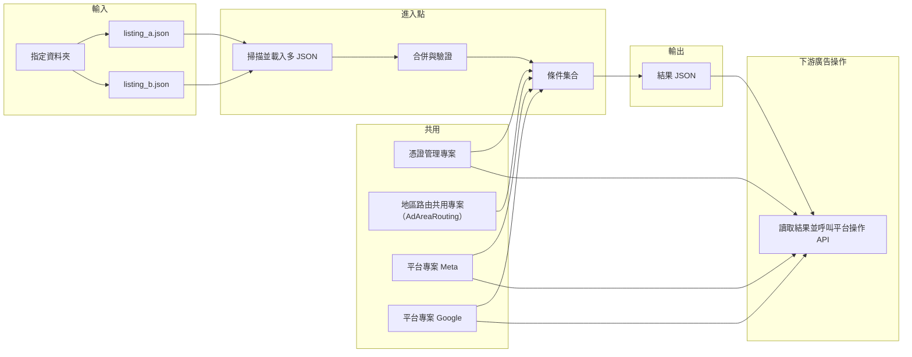

# 架構與專案分層

[← 上一篇：名詞與範圍](glossary-and-scope.md) · [回到索引](../SYSTEM_DESIGN.md) · [下一篇：輸入資料模型 →](input-model.md)

## 高階架構

## 責任分界

- **進入點**：解析 CLI／設定（輸入資料夾、輸出檔路徑、可選覆寫參數）；註冊**唯一一組**條件實作對應本次執行。
- **條件集合**：可 async；可讀取評估上下文中的 `startDate`/`endDate`、`RunId`、快取等；若需打平台**查詢** API，應透過**對應平台共用專案**，並以該列所屬**來源檔外層**之 `platform` + `credentialCustomId` 經**憑證管理專案**取得憑證。
- **條件判斷端**：不強制在進程內呼叫**開／關操作** API；**以結果 JSON 為邊界**；查詢呼叫為可選。
- **憑證管理共用專案**：唯一可信的「自定義 ID → 憑證物料」解析點；**秘密不落盤於輸入／結果 JSON**。
- **地區路由共用專案（AdAreaRouting）**：將輸入列的 `area` 映射為平台 API 所需的地區／region 代碼；當條件端呼叫平台查詢／操作相關 API 時，應使用此路由結果組裝請求。
- **平台共用專案**：封裝該平台的**查詢**與**操作**端點（可為同一組件內兩類介面，或分子模組）；**查詢與操作必須能用同一 `credentialCustomId` 解析到一致的帳戶／應用身分**（除非產品刻意區分讀寫身分，則需在設計上拆鍵並於文件註明）。
- **下游廣告操作專案**：讀取結果 JSON；**先依 `(platform, credentialCustomId)` 分組**，組內再依 API 上限**分批（預設每批 100 筆，可設定）**呼叫**操作** API；憑證每組解析一次；負責冪等、重試、節流。

## 原始碼／方案分層（建議）

| 專案（示例命名） | 職責 |
|------------------|------|
| `AdCredentials`（憑證管理共用） | 定義 `ICredentialResolver`（或同等抽象）、環境剖面（dev/stg/prod）、對 Vault／本機檔的實作；**不**依賴特定廣告平台 SDK。 |
| `AdPlatform.Meta`、`AdPlatform.Google`、… | 依平台拆分：**查詢**（供條件／稽核）與**操作**（開／關等）之 API 封裝；建構時注入由 `AdCredentials` 解析出的該列憑證。 |
| `AdAutomation.Core` | 與平台無關的領域型別、輸入／結果契約模型、條件抽象等。 |
| 條件判斷進入點 | 參考 `AdAutomation.Core`、選用之 `AdPlatform.*`、`AdCredentials`；組裝條件與批次流程。 |
| 下游廣告操作 | 參考與進入點**相同版本**之 `AdCredentials` 與 `AdPlatform.*`（至少操作面），確保與條件端查詢使用**同一憑證對照規則**。 |

**版本與設定一致**：`credentialCustomId` 在 staging／production 的對照表應由部署流程保證條件端與下游操作端讀到**同一後端**（或同一匯出檔版本），避免「判斷用 A 帳、操作誤用 B 帳」。
