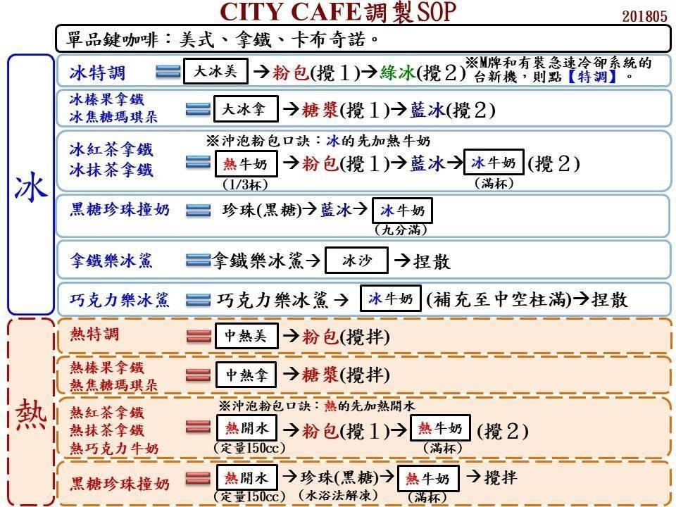
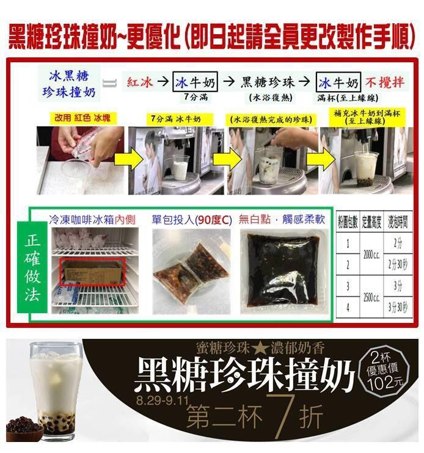
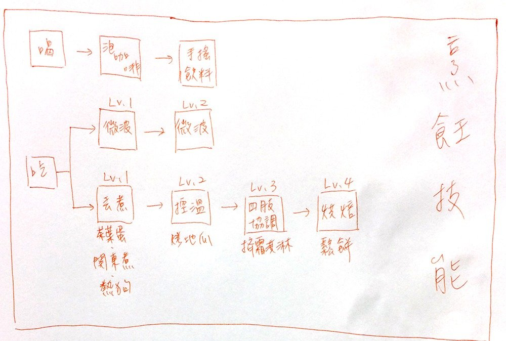
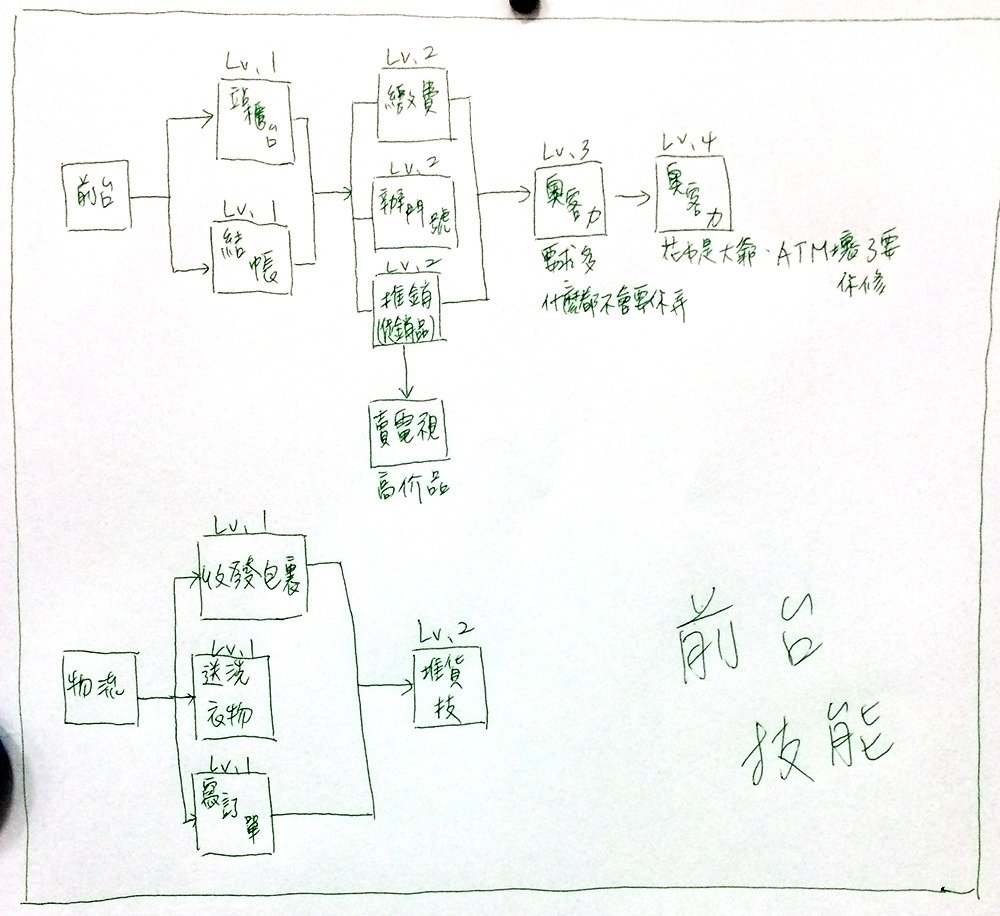
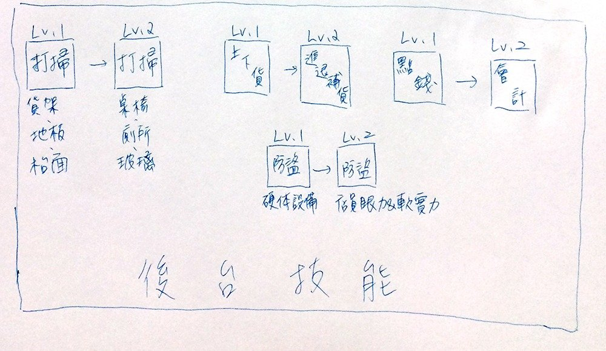
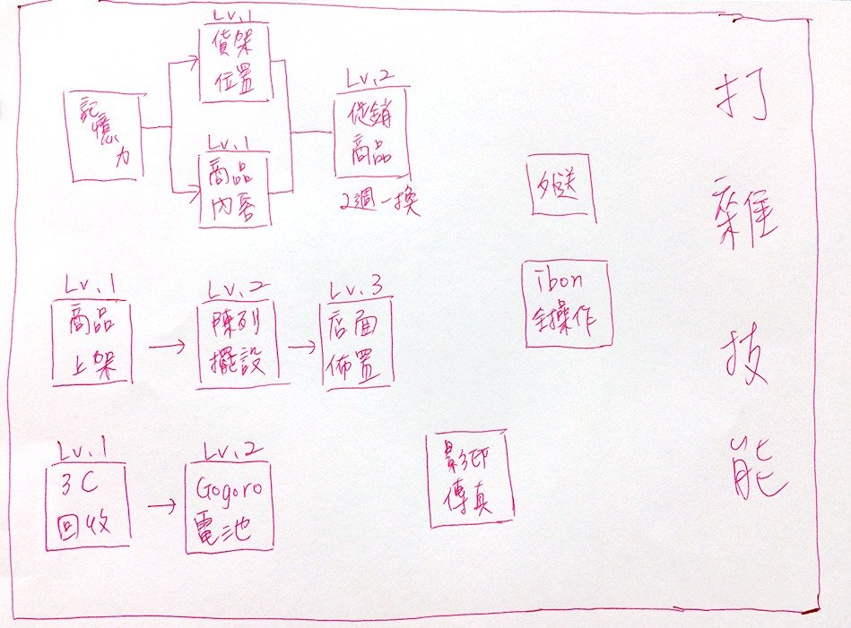
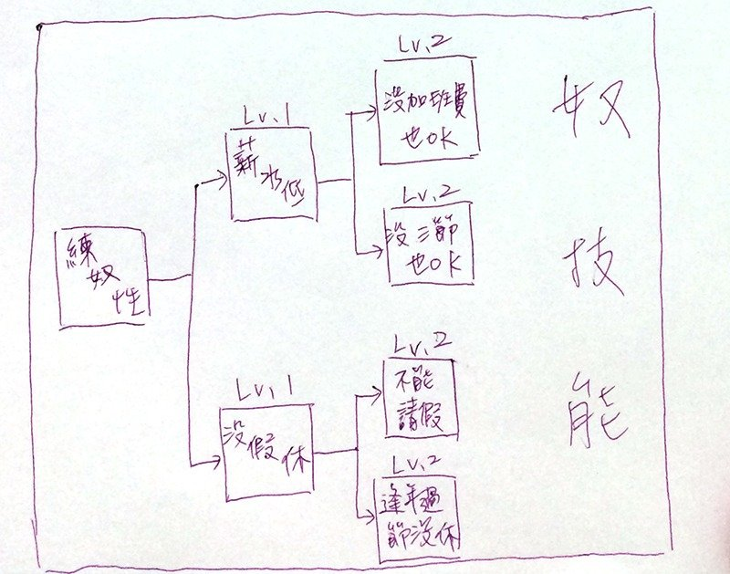

## 第 1 頁

時間 4 服裝 4 課程網站 4 便利店工作 4 門市服務丙級技術士 4 所需技能 4 交班作業 6 A 6 B 7 C 7 工作概念總結 8 收銀機作業 8 結帳 8 卡片支付 8 現金支付 9 加值 9 交易中加值 9 代繳 9 EC取貨 9 飲品 9 那不勒斯風熱檸咖啡 10 冰黑糖珍珠撞奶 10 熱黄金榛果咖啡 11 冰紅茶拿鐵 11 巧克力牛奶 11 美式 11 拿鐵 11 20190115 11 熱食 11 熱狗 11 關東煮 11 預熱關東煮 11 煮關東煮 12 茶葉蛋 12

## 第 2 頁

上架 12 消費品補充 12 補貨點貨 12 收銀機 12 過期日期填寫 12 EC網購取貨 13 已付錢(0元EC) 13 未付錢(取貨付款) 13 代繳 13 20190116 13 結帳 13 補貨點貨 13 今天忘記事項 14 收垃圾 14 換發票 14 商品條碼 14 整包賣的商品 14 單個商品但條碼有分內容物單個算和內容物全部 14 結帳時信用卡支援 14 報廢處理 15 20190117 15 列管品 15 上下班打卡 15 20190118 15 做錯事項 15 品管 15 20190123 15 爆米花製做 15 做錯事項 15 20190201 16 做錯事項 16 20190210 16 寄宅急便 16 20190211 16 鍵入毀損 16 集點卡兌換商品 16 20190212 16 點零用金 16 商品預購 17

## 第 3 頁

做錯事項 17

## 第 4 頁

時間 2,4,5早上10點 服裝 素色長褲, 衣服 課程網站 https://e-learning.pcsc.com.tw/cltcms/sitemap-page.do?nid=2583 便利店工作 1. 超商員工「沒專業性」、「誰做都可以」？他們這項能力很強大 2. 有感/我在7-11打工的兩年:不要怕困難的工作 3. 門市服務丙級技術士 門市服務丙級技術士 微創POS門市服務丙級系列教程 所需技能 咖啡 *** 奶泡溫度最好在65~68 萃取咖啡最好在23秒左右 壓咖啡粉不能旋轉 義式是直接飲用萃取咖啡, 美式是額外加入熱水 拿鐵和卡布奇諾的差別是咖啡,牛奶,奶泡的比例不同. 拿鐵是牛奶大於咖啡, 卡是牛奶咖啡比為1比1 摩卡除了比例不同外另外加上巧克力 咖啡機使用教學 濃縮咖啡+打奶泡+簡單變化 【葆哥咖學堂】第08集-美式咖啡煮法 【葆哥咖學堂】第09集-義式咖啡煮法 拿鐵不是咖啡？這些咖啡廳常見飲品到底差在哪？ How to make a coffee latte at home 自己在家做咖啡拿鐵吧 (有字幕) 卡布奇諾(cappuccino)的製作 瑪拉葳亞咖啡--拿鐵咖啡和卡布奇諾之差異 手搖飲料 * 應該都是冷凍佐料與制式流程 GTV新聞 台灣超商就是狂!店員現搖珍珠奶茶 2017042003

## 第 5 頁

微波 ** 實際練習應可 關東煮 ** 【最強窩客】20170724-小七店員的一天-上 茶葉蛋 ** 【最強窩客】20170724-小七店員的一天-上 烤地瓜 * 實際練習應可 霜淇淋 ** 實際練習應可 鬆餅 ** 平凡。平房鬆餅機操作示範 結帳 ** Pos刷卡結帳，刷推，發票作廢 保雅電腦 POS系統 - 電腦控制信用卡終端機 繳費   門號 *  推銷促銷品   賣電視   收發包裏   送洗衣物   寫訂單   打掃(貨架,地板,抬面,桌椅,廁所,玻璃) **  上下架貨 *  進退補貨   點錢 * 這應該算交班作業 會計 * 這應該算交班作業 防盜 * 員工注意客人動向 促銷商品(2週1換)   3C回收   影印傳真 *  外送

## 第 6 頁

ibon *  交班 *** 投庫 離櫃-清點現金, 留下一班運轉金, 剩下再投庫 (讀帳-印出日結帳單) (清帳-將機器歸零) ● 換發票、讀帳清帳 ● 05 結帳,退貨及投庫 ● 07投庫離櫃作業（文教服務類 A-03） ● 參考本文件-交接作業  POS操作 按投庫 > 投庫作業, 填報表 按抽屜申報 >  清點現金, 填報表 (, 留下下一班的周轉金, 剩下的錢投庫) 按交班讀帳 > 鍵入人員代號 按日結 > 換空白發票, 按日結印出日結單 菸櫃 ** 有些客人會說編號 銷售比較好的香菸記法  交班作業 A 在上班期間，把你收到的千鈔以一袋１萬～３萬整理好，投庫  （最好把圖案朝向同一面疊起來，方便作帳的人作帳喔）   要交班時：  請先把你的週轉金清點好（包括百鈔＋零錢）＞   收到的發票和禮券清點，用橡皮筋束在一起，而且要把散的鈔票從抽屜和收銀機中拿出來，以千鈔為單位先投庫，才不會造成等會因為數字太大而搞混！然後百鈔等等整理成一疊放在旁邊＞   這時候鈔票的動作處理完畢．   把兩收銀機的零錢集中在一台（此時另一台是空的），疊應給零錢給下一班＞   疊好的零錢（假設是１０００）留給清空的收銀機，剩下的零錢放到旁邊＞   零錢的動作處理完畢．

## 第 7 頁

此時，只剩下１０００塊零錢的收銀機先進行交班（這個時候這台收銀機是大夜的營業額，千萬不要把你晚班的錢再丟入這台收銀機！）＞   利用另外一台收銀機開始進行交班＞   把你的零錢清點並且換成最大額面  （假設你有５個１０元，２個５元，１個１元＝６１，  　就換成１個５０一個１０一個１元）  零錢＋鈔票裝入一個投庫袋－－投庫  中獎發票＋禮券一個投庫袋－－投庫  （比較不會算混亂掉）   這樣已經算是完成了，再檢查一下有沒有漏掉的錢，再按交班  兩台收銀機交班完畢，一切ＯＫ！   早班接晚班   除了上述的過程外，還要加入慈善募款收銀！  交班過程要用鑰匙轉日結帳後，才能交到晚班！  不然前一天的帳目會亂（犯過此錯的人＞＜） B 我也是全家店員🙋🙋  我們店的結機方式，習慣留4500當下一班找零金 1.先排零錢，從一塊開始排，湊一百 2.零錢排完後，算總共有幾百的零錢，再留鈔票(留五百或一百就好，千鈔一律投庫) 3.五百至少留兩張，其餘不夠用一百貼，總共機台要留4500元 4.其餘鈔票以及剩下無法湊一百的零錢，投庫  加油哦當初我也覺得結機超難結超慢 現在工作半年已經可以很順手了😊😊 C 交班的錢盡量都要有 我之前在我家附近的做法是（留4000給下一個班的） 500兩張 100要10張 50元跟10元要各有5組（一組10個）

## 第 8 頁

5元至少2組（一組20個）1元至少要100元有 不滿4000我就會看當天比較缺1元還是百鈔什麼的 然後就多留（前提是夠的話😂） 投庫的錢儘量全部都是千鈔 如果有可以湊成1000的百鈔或五百元就跟下面的（有放可以換鈔的袋子）換  加油～其實換久了真的就懂了而且很快就用好 我當初從全家跳槽到711上班我也都看不懂711的方式哈哈😂 還被711的同事說 投庫交班不都一樣嗎 乾哪裡一樣啦QQQQQ 感覺完全不同啊 工作概念總結 ● 下班前補充熱飲並填寫日期 ● 平常有客人排隊時結帳優先權較高 ● 趁客人較少時補充熱狗, 關東煮, 地瓜, 其它商品. 陳列商品(擺整齊) ● 等待進貨與驗收點貨上架 ● 垃圾筒滿了就整理店內所有垃圾與回收筒並打包分類放至廁所 ● 補冰櫃飲料 ● 冰櫃貨物補充. 進貨 > 冰櫃庫存 > 賣區 ● 從庫存區補足店內商品 ● 中午1200和晚上1200前挑報廢, 執行報廢流程 ● 若蛋機只剩賣相差的就執行報廢流程並清洗蛋機, 清完後放回原處並把電線插回 收銀機作業 結帳 卡片支付 電子票據(悠遊卡) 信用卡 手機支付

## 第 9 頁

現金支付 加值 交易中加值 代繳 EC取貨 飲品 熱的加砂糖, 冰的加果糖 熱的用熱杯蓋, 冰的用一般透明杯蓋 冰的另外加冰塊, 冰塊有中杯, 大杯, 超大杯專用

## 第 10 頁

那不勒斯風熱檸咖啡 1. 拿大杯加中熱美 2. 加espresso 3. 加檸檬糖漿攪拌 4. 加熱牛奶到滿 冰黑糖珍珠撞奶 1. 透明杯加紅冰 2. 加冰牛奶至7分滿 3. 加入解凍的珍珠(不用攪拌)

## 第 11 頁

4. 加冰牛奶到滿 熱黄金榛果咖啡 1. 使用中杯 2. 加入中熱拿 3. 加入黄金榛果調味包攪拌 4. 完成 冰紅茶拿鐵 1. 使用大杯 2. 加熱牛奶到1/3 3. 加入紅茶拿熱調味包攪拌 4. 加入藍冰 5. 加冰牛奶到滿 巧克力牛奶 1. 使用中杯 2. 按熱水, 它會自動加到一半 3. 加入巧克力牛奶粉攪拌 4. 按加熱牛奶加滿 5. 完成 美式 中熱美就按中熱美 > (加糖, 攪拌) > (加冰) > 打包 拿鐵 中熱拿就按中熱拿 > (加糖, 攪拌) > (加冰) > 打包 20190115 熱食 熱狗 用透明袋子包住手來拿生熱狗, 放進熱狗烤箱後方, 看起來熟了就可以用夾子夾到前面

## 第 12 頁

關東煮 預熱關東煮 看一下哪些品項需要補充, 從冰櫃拿出冷凍關東煮包, 需要的品項打開, 取出並放入關東煮用大水杯, 加熱水至蓋過內容物, 放置5分鐘, 再將水倒掉, 再一次加熱水放置5分鐘就預熱完畢 煮關東煮 第一包醬汁放大包的, 水位超過間隔板半公分以上.  之後要加水時,  用大水杯裝最少1.5公升的熱水並加入小醬包, 最後倒入鍋中, 水位超過間隔板半公分以上. 茶葉蛋 清空煮蛋器, 將60顆蛋邊敲蛋底敲出裂痕, 放入煮蛋器中, 加入二包醬包和冷水蓋住蛋(應該不用全蓋住), 蓋上吸水布, 將指針調到100度. 煮開後, 若確定熟了, 指針調到80度, 完成 上架 先進先出原則, 新的物品擺後方 消費品補充 消費品指的是杯子, 杯蓋, 筷子, 調味粉包等 消費品分散在各處櫃子, 沒事時可以翻翻看, 看有什麼東西, 這樣要補充時才不會找不到. 補貨點貨 收銀機 收500以上鈔票都要過數鈔機, 來辨別是否有偽鈔 過期日期填寫  填寫格式 執行時機 熱飲 格式例子: 0115H01181500. 代表是1月15號取出, H代表填寫人的代號, 1月18號15點過期. 這樣天數有3天.  每個熱飲可以放置的天數不一樣, 可以看熱箱右方的圖表.  時間只需要分三個時段0700, 1500, 2300 三個時段0700, 1500, 2300前確認, 不足的品項從庫存拿來補, 補之前要填寫取出時間和過期時間. 每個補足到兩罐  那三個時段就是每個班下班的時段

## 第 13 頁

咖啡機中的巨瓶牛奶 從機台下方冷藏庫取出後, 牛奶上有表格可以劃, 日期表格以打勾代表取出日, 打叉手代表過期日. 時間表格以打叉代表過期時間. 過期時間就是現在時間, 天數算3天. 寫完後, 與機台中的牛奶交換, 換出來的全部倒進機台中的牛奶, 若滿了無法倒了, 剩下的應放回冷藏庫 咖啡機牛奶不足時 冷藏庫解凍熱狗 從冷藏庫取出後, 冷凍熱狗包裝上有表格可以劃, 日期表格以打勾代表取出日, 打叉代表過期日. 時間表格以打叉代表過期時間. 過期時間就是現在時間, 天數算3天 熱狗箱熱狗不足時, 每一種熱狗需補足到三根或五根 EC網購取貨 收銀機查找電話末三碼, 可以找到名字和到貨日期, 再從EC帳本看商品是不是在員工室裡面, 沒在EC帳本裡的商品在外面 有分已付錢和未付錢 取出商品後確定是客人的都一樣要掃條碼(兩條) (收銀機印出來的最後一張要給客人簽名, 店員也要簽名) 已付錢(0元EC) 需要跟客人用身份證核對名字, 必須一模一樣, 不然任何狀況都不能交付商品 未付錢(取貨付款) 取出商品後問客人是不是他的, 確定執行付款作業(掃條碼) 代繳 掃條碼有分繳部分和繳全部, 這部分要注意. 不要掃錯條. 如果部分金額和全部金額一樣, 可以直接掃繳全部  收銀機印出來的最後一張要留著, 其它張是收據, 要和繳費單訂在一起並蓋店章 20190116 結帳 如果客人放信用卡或悠遊卡在讀卡機上, 先問客人"發票要不要存卡片上", 若要, 就直接按[卡片支付]並選擇[電子票據/信用卡/手機支付?]; 若不要, 就先按[明細?], 再按[卡片支付], 這樣就會吐出發票  如果客人買衛生綿, 用紙袋包裝起來

## 第 14 頁

補貨點貨 兩台收銀機都要按集計, 會印出表單 不管是EC還是貨品上架前要有用驗收機點貨驗收 EC用單筆驗收, 一個一個掃, 要確認已付款和未付款的數量 貨品用整筆驗收, 核對總金額. 只驗收有寫單號的 今天忘記事項 ● 關東煮加完兩次水後忘了把關東煮放入賣區 ● 地瓜蒸80分鐘後忘了拿出來 ● 熱飲補充寫完過期日後忘了放進熱飲箱中 ● 收垃圾時, 用櫃台旁的白塑膠筒來放回收物品 ● 忘了找客人錢 收垃圾 1. 拿櫃台旁的白塑膠筒(回收筒) 2. 到店中間垃圾筒取出回收物品放入白塑膠筒 3. 將櫃台旁的垃圾筒中的垃圾倒入店中間垃圾筒 4. 將員工室的垃圾也倒入店中間垃圾筒 5. 將店中間垃圾筒打包, 和白塑膠筒一起移到員工廁所 6. 將白塑膠筒的回收物分類放至廁所的分類箱 7. 打包垃圾放在箱中下方 8. 完成. 等下班前再拿去倒 換發票 打開新發票後, 紅線和有毀損的的部分拉出來, 紙卷朝下放入機器, 蓋上蓋子 商品條碼 整包賣的商品 有些多個包裝起來的貨物有分整包賣和單個賣, 單個賣就要拆掉. 不確定能不能整包賣的話, 就把整包上的條碼拿去收銀機掃掃看. 若能掃, 就不用拆. 單個商品但條碼有分內容物單個算和內容物全部 比如豆腐這個商品, 內容物是四塊切好的豆腐. 條碼就有分單塊的, 和整包四塊的. 掃條碼時要注意, 若是掃單塊要掃四次; 整包的掃一次. 邊掃時可以看著螢幕, 若價格不合理就有可能掃錯了 結

## 第 15 頁

結帳時信用卡支援 中興, 玉山, 國泰 報廢處理 茶葉蛋將賣相不好的挑掉, 過期的食品挑掉. 到員工室電腦輸入, 輸入時記得按確認鍵. 輸入完的商品要在條碼上打X 20190117 列管品 酒, 煙(條) 酒在賣出時要記錄 煙條在拆開上架前要記錄 記錄在白色紙疊上 上下班打卡 必須上班前半小時內, 下班後半小時內. 上班忘記打卡的話, 就在下班時打就行 20190118 做錯事項 ● 咖啡漬箱丟掉時, 沒有再做一個 ● 太空包(包裝餅干)進貨多餘時, 不必拆箱放到員工室庫存區. 太空包庫存區在廁所旁 ● 垃圾拿去倒時因為臨時需要留下一袋垃圾而將垃圾放在廁所外而不在廁所內 ● 驗收EC時太慢並且沒有找到第7件0元的 ● 上架補貨找商品位置太慢 品管 在日誌記錄各個冰箱溫度等 20190123 爆米花製做 1. 將整片包裝捏一捏(捏散玉米)，不必打開

## 第 16 頁

2. 微波按7 做錯事項 ● 忘了找錢 ● 找錯了錢 ● 微波忘了按第二次(有些商品要微波2次) 20190201 做錯事項 1. 忘了倒咖啡渣 20190210 寄宅急便 寄件單填寫完後, 收銀機點擊正確的宅急便, 掃寄件單的條碼, 在寄件單上寫上金額, 寄件單是複印的, 有上下兩張, 兩張都要蓋店章, 將第一張撕下來連同小白單訂起來還給顧客 20190211 鍵入毀損 在驗收非EC時, 要順便做鍵入毀損的動作.  到冷藏庫找出依班別找出毀損品(比如便當在晚班), 選出有進該商品的進貨單, 驗收機找出同樣單號的進貨單, 選單筆驗數, 用掃描機掃商品條碼, 機器會列出進貨數量, 將進貨數量改為減去毀損品數量的量, 按確定.  若單上有其它有打星號的也用單品驗收. 查看它的進貨數量是否和單上一致. 單筆驗收完後, 機器會重新計算總金額, 將新的總金額改寫回進貨單上  沒有毀損的進貨單, 則直接用整筆驗收就行了 集點卡兌換商品 找出商品與商品條碼(比如咖啡在集點卡上, 玉米濃湯在架上, 玻璃杯在菸櫃下), 先掃商品條碼後, 再掃集點卡上的折扣條碼.

## 第 17 頁

20190212 點零用金 每班都下幫下一班點零用金15000, 填寫在下一班的零用金的填寫欄位. 比如下午一點時, 自己在早班, 但要幫晚班點零用金. 晚上九點時要幫夜班點零用金.  商品預購 點擊收銀機的商品預購, 收錢. 機器會印出取貨單, 給顧客簽名. 一張門市存留 做錯事項 收錢100按成104, 結果找不到原因, 拖了很多時間

## 第 18 頁

## 第 19 頁

## 第 20 頁

## 第 21 頁

